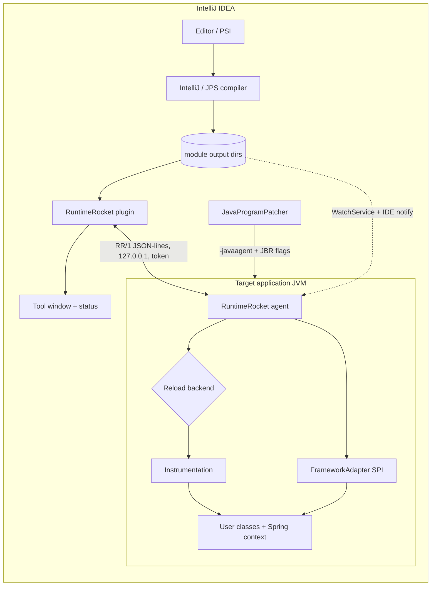
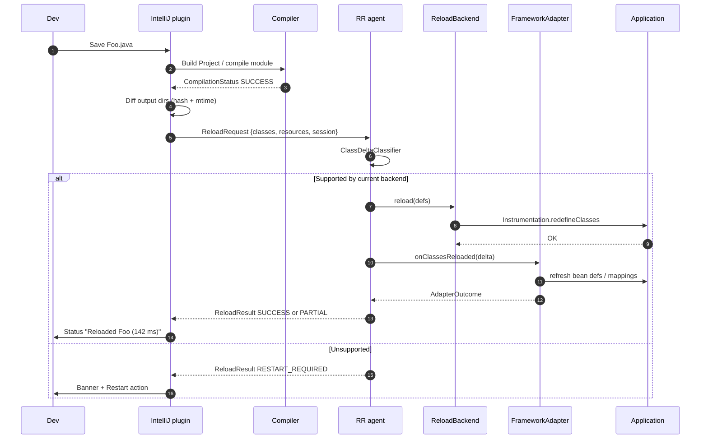
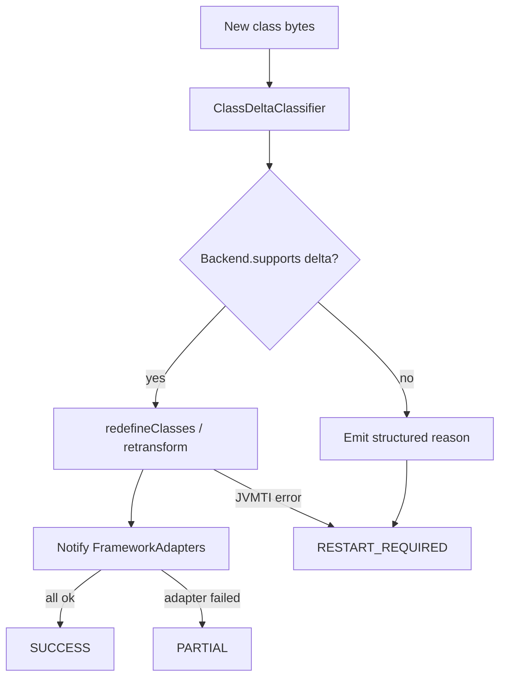

# RuntimeRocket Design

| Field | Value |
| --- | --- |
| **Title** | RuntimeRocket — JRebel-style JVM reload for IntelliJ |
| **Author** | RuntimeRocket maintainers (placeholder) |
| **Date** | 2026-08-15 |
| **Status** | Approved 2026-08-15; 0.1.0-SNAPSHOT implemented (PRs 1–12) |
| **Audience** | Senior engineers implementing this repository |
| **Workspace** | `F:\grok\RuntimeRocket` |

---

## Overview

RuntimeRocket is a greenfield, open-source alternative to commercial JVM class-reloading tools. It is an IntelliJ Platform plugin plus a Java agent: after a successful compile, changed `.class` files are redefined in a running application JVM, **without restarting the process**. Supported reloads preserve **object identity**, **existing field values**, and **Spring singleton instances**. They do **not** re-run constructors or `<clinit>`, do **not** flush arbitrary application caches (Jackson, `ReflectionUtils`), and do **not** rewrite HTTP session contents — sessions stay only because the objects already in them stay.

Standard JPDA HotSwap (`Instrumentation.redefineClasses` on a stock HotSpot/OpenJDK) only permits method-body changes. RuntimeRocket goes further by selecting a concrete reload **backend** at attach time:

1. **Enhanced HotSwap backend (v1 primary).** When the target JVM is JetBrains Runtime (JBR) or another DCEVM-derived JDK started with `-XX:+AllowEnhancedClassRedefinition`, the agent uses JVMTI redefinition to add/remove/rename methods and fields and to add classes. Existing instances keep identity; newly added instance fields on those instances receive Java default values. New static fields also stay at defaults (`<clinit>` is not re-run) — the field is visible to reflection but not initialized. **Adding an enum constant is `RESTART_REQUIRED` in v1** (JBR will accept the class file, but `$VALUES` / `values()` stay stale without a `<clinit>` repair we are not shipping). This is the path that makes “save → see it” real for everyday Java/Spring work.
2. **Standard HotSwap backend (v1 fallback).** On a stock JDK, method-body changes still reload. Structural changes are **classified and reported as `RESTART_REQUIRED`** — never silently ignored.
3. **Versioning backend (v1.1, designed now).** A load-time instrumentation / companion-class dispatcher that works on stock JDKs for a bounded subset (add method, add field, method body). The agent SPI is backend-pluggable so this can land without rewriting the IDE or framework layers.

Framework-specific recovery (Spring bean definitions, handler mappings, caches) is **not** hardcoded in the agent core. Adapters implement `io.runtimerocket.agent.spi.FrameworkAdapter` and are discovered via `ServiceLoader`.

The repository is a Gradle multi-module project. All subsequent implementation lands **directly** in `F:\grok\RuntimeRocket` (no isolated worktrees, no temp-only deliverables).

---

## Background & Motivation

A typical Java web service restart is 10–60 seconds; a large Spring Boot app is often 30–120 seconds. Developers who change one method pay that tax dozens of times per hour and lose flow. IntelliJ’s built-in “Reload Changed Classes” is JPDA HotSwap: it works only while debugging, and the JVM rejects anything except method-body edits.

Publicly documented prior art (studied, not copied; JRebel binaries will not be reverse-engineered):

| System | Public model | License | Relevance |
| --- | --- | --- | --- |
| **JRebel** | Java agent instruments existing class loaders (does **not** wrap throwaway loaders). Associates a loaded class with a `.class` file (classpath + `rebel.xml`). Watches timestamps / OS file events. Reloads through the same loader and preserves instances. New instance fields on existing objects are **not** constructor-initialized. Framework plugins re-init caches/registries. Uses Instrumentation to hook loaders, **not** as the reload mechanism. Requires a special IDE plugin to debug rewritten bytecode. Works on stock JVMs. | Proprietary | Product UX, plugin-SPI shape, `rebel.xml` analog, failure honesty |
| **HotswapAgent + DCEVM / JBR** | Relies on **enhanced HotSwap** in a patched HotSpot (`-XX:+AllowEnhancedClassRedefinition` on JBR 17/21/25). Agent is a plugin container: watch services + `@Plugin` / `@OnClassLoadEvent` / `@OnClassFileEvent`. Spring plugin hooks `DefaultListableBeanFactory` and reloads bean definitions. Hierarchy (superclass) changes unsupported. | **GPL-2.0** | Architecture of enhanced HotSwap + framework plugins. **Do not copy source.** |
| **Spring Loaded** (archived) | Load-time rewrite so types are reloadable; add/modify/delete methods, fields, constructors, annotations, enum values. Hierarchy changes unsupported. Reflection results update after reload; app-level reflection caches must be flushed via `ReloadEventProcessorPlugin`. Grails 2–4 used it. Java 11+ unfinished. | Apache-2.0 | Proof that a versioning dispatcher on a stock JVM is feasible; study the *idea*, write original code |
| **Byte Buddy / `Instrumentation`** | Excellent codegen and `redefine`/`retransform` helpers. **Cannot** exceed JVMTI limits on a stock VM. | Apache-2.0 | Codegen library for adapters and the versioning backend |
| **Spring Boot DevTools** | Restarts in a new class loader; **discards state**. | Apache-2.0 | What we are explicitly *not* doing |

Pain points this design addresses:

- Stock HotSwap is too narrow for real edits (new methods, new fields, new Spring beans).
- JRebel is closed-source and commercial.
- HotswapAgent is capable but GPL-2.0 (incompatible with an Apache-2.0 plugin we control), requires manual JDK/VM-option setup, and has no first-class IntelliJ flow-state UX (status, “you must restart”, run-config injection).
- When this design was written the repo was empty (`README.md` title only). PRs 1–12 landed the modules, protocol, agent, plugin, Spring adapter, docs, and CI described here.

---

## Goals & Non-Goals

### Goals (v1)

- **G1.** After a successful compile, a typical 1–5 class edit reaches the running app in **p50 ≤ 800 ms, p95 ≤ 2 s**, measured **compile-finished → status bar**. Compile time is a separate widget state and is **not** part of this SLO.
- **G2.** Preserve live object identity, existing instance/static field values, and Spring singleton instances across supported reloads. New fields on existing instances stay at Java defaults. v1 does **not** claim Jackson / `ReflectionUtils` / full advisor-cache flushing.
- **G3.** Support, on JBR/DCEVM: method body; add/remove/rename methods; add/remove instance fields (existing instances get default values); add static fields (visible, remain default — result note says so); add constructors; add top-level/nested classes; annotation changes. **Enum constant add/remove/reorder is `RESTART_REQUIRED`.**
- **G4.** On stock JDK: reload method-body changes; **explicitly fail** every unsupported structural change with a reason and a one-click “Restart run configuration” action.
- **G5.** IntelliJ UX: tool window, status-bar widget, balloon notifications, gutter icon on the last reloaded class, run-configuration checkbox that injects `-javaagent` (and JBR flags when applicable) on **Application** run configurations (Community) and, if the optional Spring plugin is present, **Spring Boot** run configurations (Ultimate). Gradle `bootRun` / `JavaExec` is a documented v1 limitation (PR 16).
- **G6.** Attach at start (`premain`) and optionally late-attach via `VirtualMachine.attach`. Late attach **redefines classes**. Late attach **+ Spring bean/mapping refresh is best-effort** and usually requires `premain`: an idle Boot process typically has no `ContextLoader` / request, so the adapter reports `PARTIAL` rather than pretending to be live. A later inbound request may still register the context via the retransform hook.
- **G7.** Framework SPI; ship a Spring adapter for **Boot 3.5+ and Boot 4.x / Framework 6.2–7** via version-gated helpers. Agent core has zero Spring types on its compile classpath.
- **G8.** Agent usable **without** the IDE (`-javaagent:runtimerocket-agent.jar` + generated `runtimerocket.xml`). Forked launchers that never see `JavaProgramPatcher` require a manual `-javaagent` (v1 limitation).
- **G9.** Portable: Windows (primary dev env), macOS, Linux. Agent / protocol / fixtures bytecode **Java 17**. `:plugin` compiles with the Platform Plugin **Java 21** toolchain (IDEA 2024.3+ is a Java 21 IDE). Application class files **17 and 21 required**, **25 supported**. Plugin targets IntelliJ IDEA **2024.3–2026.2** (`since-build=243`, `until-build=262.*`).
- **G10.** Apache-2.0 throughout. No GPL code. No JRebel bytecode or decompilation.

### Non-Goals (v1)

- **NG1.** Production / staging use. This is a developer-machine tool. The agent refuses to start if `RUNTIMEROCKET_ALLOW_NONDEV` is unset and a **platform** production heuristic matches (k8s / Azure / Heroku / `rr.production`). `prod`+`PORT` is a warning only (see Security).
- **NG2.** Changing a class’s superclass or removing an implemented interface (not supported by JBR enhanced redefinition either).
- **NG3.** Jakarta EE, Hibernate/JPA weaving, Quarkus, Micronaut, Java EE app servers. SPI only; adapters come later.
- **NG4.** Kotlin-specific semantics beyond “compile to JVM bytecode and reload” (inline functions, `internal` name mangling surprises are documented limitations).
- **NG5.** Reloading JDK / Java module classes, or classes loaded by the bootstrap loader.
- **NG6.** A full debugger-mapping layer for rewritten bytecode. v1 primary backend uses JVM HotSwap, so the existing JPDA debugger keeps working. The versioning backend (v1.1) will need SMAP/line-number work — out of v1.
- **NG7.** Remote JVM reload over the network (only loopback).
- **NG8.** Re-running constructors or field initializers / `<clinit>` on existing instances (matches JRebel’s public behavior). New statics and new enum constants therefore stay uninitialized.
- **NG9.** Replacing JRebel feature-for-feature (100+ framework plugins).
- **NG10.** Adding, removing, or reordering enum constants. JBR can rewrite the class file; without a `$VALUES` / `values()` repair (out of v1) the public enum API is wrong, so the classifier returns `RESTART_REQUIRED`.
- **NG11.** Injecting resource *bytes* into live `ClassLoader`s. v1 only notifies adapters about files already on disk under a watched directory.

---

## Proposed Design

### 1. Repository layout

```
F:\grok\RuntimeRocket\
├── AGENTS.md
├── README.md
├── LICENSE                          # Apache-2.0
├── NOTICE
├── settings.gradle.kts
├── build.gradle.kts                 # versions, javadoc/ktlint conventions
├── gradle.properties
├── gradlew / gradlew.bat
├── gradle/wrapper/
├── docs/
│   ├── design.md                    # this document (canonical in-repo copy)
│   └── legal.md                     # license matrix, contribution DCO
├── protocol/                        # :protocol   (pure Java 17, no deps)
├── agent-api/                       # :agent-api  (SPI + events, Java 17)
├── agent/                           # :agent      (javaagent fat JAR)
├── frameworks/
│   └── spring/                      # :frameworks:spring (main=6.2, src/fw7=Framework 7)
├── plugin/                          # :plugin     (IntelliJ Platform, Kotlin)
├── fixtures/
│   ├── plain-java/                  # :fixtures:plain-java
│   ├── spring-boot/                 # :fixtures:spring-boot (Boot 4.1 / Framework 7)
│   └── two-module/                  # :fixtures:two-module (lib + app, two runtimerocket.xml)
└── integration-tests/               # :integration-tests
```

| Module | Language | Artifact | Depends on |
| --- | --- | --- | --- |
| `:protocol` | Java 17 | `runtimerocket-protocol.jar` | none |
| `:agent-api` | Java 17 | `runtimerocket-agent-api.jar` | `:protocol` |
| `:agent` | Java 17 | `runtimerocket-agent-<ver>-all.jar` (Shadow) | `:protocol`, `:agent-api`, ASM, bundled adapters |
| `:frameworks:spring` | Java 17 | thin JAR, also merged into agent fat JAR | `:agent-api`; **main** `compileOnly` Spring **6.2 / Boot 3.5** only; source set `fw7` `compileOnly` Spring **7 / Boot 4.1** (separate compilation — never one classpath) |
| `:plugin` | Kotlin 2.0 / **JVM 21** | `runtimerocket-<ver>.zip` | `:protocol`; **does not** depend on Spring or ASM at runtime except protocol |
| `:fixtures:*` | Java 17 | test apps, not published | — |
| `:integration-tests` | Java 17 + JUnit 5 | forks JVMs | `:agent`, fixtures |

Root `settings.gradle.kts`:

```kotlin
rootProject.name = "runtimerocket"
include(
    "protocol",
    "agent-api",
    "agent",
    "frameworks:spring",
    "plugin",
    "fixtures:plain-java",
    "fixtures:spring-boot",
    "fixtures:two-module",
    "integration-tests",
)
```

Pinned versions (`gradle.properties`):

```properties
rr.version=0.1.0-SNAPSHOT
# Agent / protocol / fixtures / tests only. Do NOT apply via subprojects {} —
# :plugin must use the Platform Plugin Java 21 toolchain (IDEA 2024.3+).
java.toolchain=17
kotlin.version=2.0.21
# ASM 9.8+ is required for Opcodes.V25 (JBR 25 / class file 69)
asm.version=9.8
junit.version=5.11.4
# Gradle 9-compatible Shadow (8.3.6 broke on 9.0 RC). Plugin id com.gradleup.shadow.
shadow.version=8.3.9
# Platform Plugin 2.18.1 knows 262 descriptors; requires Gradle 9.0+
intellij.platform.version=2.18.1
platform.type=IC
# Compile against the API floor; verify against 2024.3 and 2026.2
platform.version=2024.3
plugin.since.build=243
plugin.until.build=262.*
```

**Compatibility window (normative).** Oldest supported IDE is IntelliJ IDEA **2024.3** (build 243). Newest verified IDE is **2026.2** (build 262). `until-build=252.*` is forbidden — that is 2025.2 and current IDEs refuse it. Gradle wrapper is **9.0+** because Platform Plugin 2.18.1 requires it. `pluginVerifier` in PR 12 runs against **`IC-2024.3`**. 2026.2 is a follow-up: IC installers ended at 2025.3; the unified `IntellijIdea` type needs a pinned 2026.2.x and a large extra download.

**Toolchains (normative, PR 1).** `:protocol`, `:agent-api`, `:agent`, `:frameworks:spring`, `:fixtures:*`, `:integration-tests` set `java.toolchain` **17**. `:plugin` does **not** inherit that pin; `org.jetbrains.intellij.platform` sets **Java 21**. A root `subprojects { java { toolchain 17 } }` is forbidden.

**Application bytecode.** Classifier and redefine path must accept class-file versions 61 (17), 65 (21), and 69 (25). PR 3 golden tests include at least one v69 file. Runtime of the *agent* remains Java 17.

`:plugin` applies `org.jetbrains.intellij.platform`. Other modules are plain `java` / `java-library`. The agent fat JAR is produced by Gradle Shadow and **copied into** `plugin/src/main/resources/io/runtimerocket/plugin/agent/runtimerocket-agent.jar` by a `syncAgentIntoPlugin` task so the IDE plugin always ships a matching agent.

Build from Windows PowerShell:

```powershell
.\gradlew.bat :plugin:buildPlugin :agent:shadowJar :integration-tests:test
```

### 2. Package map

| Package | Module | Role |
| --- | --- | --- |
| `io.runtimerocket.protocol` | `:protocol` | Framing, message types, JSON codec |
| `io.runtimerocket.agent` | `:agent` | `AgentMain`, `AgentRuntime` |
| `io.runtimerocket.agent.reload` | `:agent` | Backends, classifier, orchestrator |
| `io.runtimerocket.agent.watch` | `:agent` | Classpath / resource watcher |
| `io.runtimerocket.agent.net` | `:agent` | Loopback server |
| `io.runtimerocket.agent.config` | `:agent` | `runtimerocket.xml` + system props |
| `io.runtimerocket.agent.spi` | `:agent-api` | `FrameworkAdapter`, events |
| `io.runtimerocket.frameworks.spring` | `:frameworks:spring` | Spring Boot adapter |
| `io.runtimerocket.plugin` | `:plugin` | Plugin entry / services |
| `io.runtimerocket.plugin.run` | `:plugin` | `JavaProgramPatcher`, attach |
| `io.runtimerocket.plugin.watch` | `:plugin` | Compile / VFS listeners |
| `io.runtimerocket.plugin.ui` | `:plugin` | Tool window, status, notifications |
| `io.runtimerocket.plugin.settings` | `:plugin` | Persistent settings |

### 3. System architecture



Two change-detection paths exist; both are required, but they **must not** start two `redefineClasses` calls at once:

- **IDE-driven (low latency, rich UI).** After a successful compile, the plugin diffs module output directories against a per-session snapshot and sends `ReloadRequest` with the exact class bytes. This is how we hit the reload SLO and show per-file status.
- **Agent-driven (standalone / missed events).** The agent watches directories listed in `runtimerocket.xml` (and any `URLClassLoader` file URLs it observes). Debounced file events become reloads even if the IDE is disconnected.

**Single-flight and dedup (normative).** `ReloadOrchestrator` holds one mutex. At most one `redefineClasses` batch is in flight. Incoming requests (IDE or watcher) are keyed by `(binaryName, sha256)`:

1. If an identical key was applied or received in the last **1 s**, drop it (`SKIPPED`, reason `duplicate`).
2. If a reload is in flight, enqueue **at most one** coalesced follow-up that unions new `(name, sha256)` pairs; do not start a second JVMTI call until the first returns.
3. After an IDE `ReloadRequest` with `trigger=compile`, the watcher **suppresses** events for those canonical paths for 1 s (the compiler already wrote the files).
4. `ReloadResult.status = PARTIAL` means **only**: JVMTI redefine/define succeeded, and one or more adapters returned a non-success `AdapterOutcome`. It is never “some classes redefined, some not.”
5. If any class in the batch is `UNSUPPORTED`, the whole batch is aborted **before** `defineClass` / `redefineClasses` and the status is `RESTART_REQUIRED`.

The agent is the **source of truth**. The IDE never calls `redefineClasses` itself (that would require the debugger and would be limited to HotSwap). The IDE is control plane + UX. While an RR session is attached, the plugin **vetoes stock HotSwap for that process, or prompts the user to set it to Never** (see §7.4) — it does **not** persist a global `DebuggerSettings` write.

### 4. End-to-end sequence



### 5. Reload strategy (the decision)

**Pick: two-tier HotSwap with a third, later versioning backend. v1 ships tiers 0 and 1.**



#### 5.1 Why not JRebel-style versioning as v1 primary?

Public JRebel material is explicit: they do **not** use `Instrumentation.redefineClasses` as the reload mechanism; they rewrite class loaders and version methods so the `Class` object’s layout can appear to change on a stock JVM. That is years of bytecode, reflection, `invokedynamic`, serialization, and debugger work. Spring Loaded proved a smaller version of it and then stalled on Java 11+ (`invokedynamic`, nestmates, records, sealed classes). Shipping that as v1 would delay a usable IntelliJ plugin by many months and would break the built-in debugger (JRebel needs a special debug plugin for this reason).

Enhanced class redefinition already exists in **JetBrains Runtime**, the JDK IntelliJ itself ships. Enabling `-XX:+AllowEnhancedClassRedefinition` is a one-line VM option. Supported **application** bytecode is Java **17, 21, and 25** (ASM ≥ 9.8). CI for 0.1 runs JBR **17 and 21**; JBR 25 is in the classifier golden set and is a verify-on-available job, not deferred to 0.2. This is the shortest path to “add a method, add a field, keep state.”

#### 5.2 Backend contract

```java
package io.runtimerocket.agent.reload;

import io.runtimerocket.agent.spi.Capabilities;

import java.lang.instrument.Instrumentation;
import java.util.List;

/** Agent-internal. Not referenced from :agent-api. */
public interface ReloadBackend {
    String id();                          // "enhanced" | "standard" | "versioning"
    Capabilities capabilities();

    /** Probe once at agent start. Must be side-effect free besides a trial redefine of a synthetic class. */
    boolean probe(Instrumentation inst);

    Support assess(ClassDelta delta);

    ReloadBackendResult apply(Instrumentation inst, List<Redefinition> batch) throws Exception;
}

/**
 * Result of {@link ReloadBackend#assess}. v1 is fail-closed:
 * PARTIAL (backend can do some ChangeKinds in this delta but not others)
 * is treated as UNSUPPORTED for the whole batch.
 * This is not the wire status ReloadResult.status=PARTIAL.
 */
public enum Support { FULL, PARTIAL, UNSUPPORTED }

/** Agent-internal batch item. Bytes live here, not in :protocol as ClassBytes. */
public final class Redefinition {
    public final Class<?> loaded;
    public final byte[] bytes;
    public final ClassDelta delta;
}
```

`Capabilities` lives in **`:agent-api`** (`io.runtimerocket.agent.spi.Capabilities`) so events can mention it without depending on `:agent`:

```java
package io.runtimerocket.agent.spi;

public final class Capabilities {
    public final boolean methodBody;
    public final boolean addRemoveMethods;
    public final boolean addRemoveFields;
    public final boolean addConstructors;
    public final boolean hierarchyChanges;   // always false in v1
    public final boolean enumConstants;      // always false in v1 (see NG10)
    public final boolean anonymousRemap;     // always false in v1
}
```

**Selection order** (`BackendSelector`):

1. If `-Drr.backend=standard|enhanced|versioning` is set, honor it (fail start if probe fails).
2. Else if `enhanced.probe(inst)` (looks for JBR/`AllowEnhancedClassRedefinition`, then trial-redefines a throwaway class that *adds a method*), use enhanced.
3. Else use standard.
4. Versioning is never auto-selected until v1.1 declares it stable.

Probe implementation for enhanced (do this once, on a class the agent defines itself):

```java
// Define io.runtimerocket.agent.reload.ProbeTarget with method a()
// Redefine it to add method b() : void
// If redefineClasses throws UnsupportedOperationException / InternalError → no enhanced
```

Also parse `java.vm.name` / `java.vm.vendor` for `"JetBrains"` and check `ManagementFactory.getRuntimeMXBean().getInputArguments()` for `-XX:+AllowEnhancedClassRedefinition`. The trial redefine is authoritative.

#### 5.3 Class delta classifier

Implemented in `:agent` with **ASM** `ClassReader` + a custom visitor (no Byte Buddy on the hot path). Inputs: previous bytes (from `ClassFileTransformer` cache or the last successful reload) and new bytes.

```java
package io.runtimerocket.agent.reload;

public final class ClassDelta {
    public final String internalName;
    public final EnumSet<ChangeKind> kinds;
    public final List<MemberRef> addedMethods;
    public final List<MemberRef> removedMethods;
    public final List<MemberRef> bodyChangedMethods;
    public final List<MemberRef> addedFields;
    public final List<MemberRef> removedFields;
    public final boolean superclassChanged;
    public final boolean interfacesChanged;
    public final boolean nestHostChanged;
    public final boolean permittedSubclassesChanged;
    public final boolean recordComponentsChanged;
    public final boolean enumConstantsChanged;
    public final boolean anonymousIndexShiftLikely;
}

public enum ChangeKind {
    NEW_TYPE,
    METHOD_BODY,
    ADD_METHOD, REMOVE_METHOD, CHANGE_METHOD_DESC, CHANGE_METHOD_MODIFIERS,
    ADD_FIELD, REMOVE_FIELD, CHANGE_FIELD_DESC, CHANGE_FIELD_MODIFIERS,
    ADD_CONSTRUCTOR, REMOVE_CONSTRUCTOR,
    HIERARCHY_SUPER, HIERARCHY_IFACES,
    CLASS_MODIFIERS,
    ANNOTATIONS,
    ENUM_CONSTANTS,
    RECORD_COMPONENTS,
    NESTMATES,
    PERMITTED_SUBCLASSES,
    INNER_CLASSES_MAP,
    CONSTANT_POOL_ONLY
}
```

Compare structural members by `(name, descriptor)`. Treat `<init>` / `<clinit>` separately. A changed method body is `METHOD_BODY` only when the descriptor is unchanged. Source-file / `LineNumberTable` / `LocalVariableTable` only → `CONSTANT_POOL_ONLY` (still redefine, cheap).

**Anonymous / lambda heuristic.** If `InnerClasses` or `BootstrapMethods` gain/lose entries that rename `Foo$1` → `Foo$2` (index shift), set `anonymousIndexShiftLikely`. v1 treats that as `RESTART_REQUIRED` on both backends. Adding a *new* trailing `Foo$N+1` without remapping existing `$1..$N` is allowed on enhanced.

#### 5.4 v1 support matrix

| Change | Enhanced (JBR/DCEVM) | Standard HotSwap | Versioning (v1.1) |
| --- | --- | --- | --- |
| Method body | Yes | Yes | Yes |
| Add / remove / rename method | Yes | No | Add only |
| Change method descriptor | Yes (as remove+add) | No | No |
| Add instance field | Yes; existing instances defaulted; result note | No | Yes; identity extra-field table; defaulted |
| Add static field | Yes; **remains default** (`<clinit>` not re-run); result note “uninitialized” | No | Same defaulting |
| Remove field | Yes (JBR); existing values dropped | No | No |
| Change field type | No — `RESTART_REQUIRED` | No | No |
| Add constructor | Yes | No | New instances only |
| Superclass change | No | No | No |
| Add/remove interface | No (v1) | No | No |
| Class modifiers (`final`, `abstract`) | Best-effort; fail → restart | No | No |
| Add / remove / reorder enum constants | **No — `RESTART_REQUIRED`** (stale `$VALUES`) | No | No |
| Record component change | No | No | No |
| Sealed `permits` change | No | No | No |
| Lambda / anonymous index shift | No | No | No |
| New top-level class | Yes (`ClassLoader.defineClass`; irreversible) | Yes (`defineClass`) | Yes |
| Delete class (still referenced) | `RESTART_REQUIRED` | `RESTART_REQUIRED` | `RESTART_REQUIRED` |
| Resource change (`.xml`, `.properties`, static) | Notify only; no byte inject (see §8) | Notify only | Notify only |
| `static {}` initializer | **Not re-run** | Not re-run | Not re-run |
| Kotlin `object` / companion | Yes if bytecode-compatible | Body only | TBD |

#### 5.5 Applying a batch

```java
package io.runtimerocket.agent.reload;

public final class ReloadOrchestrator {
    public ReloadResult reload(ReloadRequest req) {
        // 0. Acquire single-flight mutex; coalesce/drop duplicates (§3)
        // 1. Resolve Class<?> via ClassIndex (name + loader)
        // 2. Classify each; assess() PARTIAL → treat as UNSUPPORTED
        // 3. If any UNSUPPORTED → abort before any define/redefine
        // 4. defineClass brand-new types (NOT part of the JVMTI transaction)
        // 5. One Instrumentation.redefineClasses(...) for already-loaded types
        // 6. Fire ClassReloadedEvent; collect AdapterOutcome from each adapter
        // 7. SUCCESS if JVMTI ok and all adapters ok;
        //    PARTIAL if JVMTI ok and any adapter failed;
        //    FAILED / RESTART_REQUIRED if step 5 throws (list types defined in step 4)
    }
}
```

**Atomicity (honest).** `Instrumentation.redefineClasses(ClassDefinition...)` is all-or-nothing **for the already-loaded types in that call**. `defineClass` of **new** types is **not** in that JVMTI transaction and **cannot be undone**. If step 4 succeeds and step 5 throws, the JVM keeps the new types and the old versions of mutated types. The result is then `FAILED` or `RESTART_REQUIRED` and `ClassOutcome` lists every name that was `DEFINED` so the user knows the process is dirty. v1 does **not** call the end-to-end operation atomic. The classifier `assess()` of the whole batch runs *before* step 4 so the common failure (unsupported shape) never defines anything.

**New class definition.** Primary path on Java 17: reflect `ClassLoader.defineClass(String, byte[], int, int)` after the patcher injects `--add-opens=java.base/java.lang=ALL-UNNAMED`. Walk known application class loaders (those that previously loaded a watched class). `Lookup.defineClass` / `privateLookupIn` from the **agent** loader into an app loader fails often (different loaders, missing class host); it is a fallback only, not the sketched happy path.

**Class index.**

```java
public final class ClassIndex {
    // ConcurrentHashMap<LoaderKey, Map<String /*binary name*/, Class<?>>>
    // Populated by a ClassFileTransformer that records every DEFINE of a watched package.
    public Optional<Class<?>> find(String binaryName);
    public List<Class<?>> findAll(String binaryName); // same name, multiple loaders
}
```

If the same name is loaded in two application loaders (Tomcat-style), redefine **all** copies whose code source is under a watched directory.

#### 5.6 Versioning backend (v1.1 — designed, not shipped)

Documented so the SPI and tests are not painted into a corner.

Load-time (`ClassFileTransformer`, `canRetransform=true`) for classes whose code source is watched:

1. Skip `java.*`, `javax.*`, `jdk.*`, `sun.*`, `io.runtimerocket.*`, and anything from a `.jar` unless listed in `runtimerocket.xml` extra classpath.
2. Generate companion `com.example.Foo$$rr$v0` containing the original method bodies as static methods that take `Foo this` as first arg (instance) or no extra arg (static).
3. Rewrite `Foo` methods to `invokedynamic` with bootstrap `io.runtimerocket.agent.versioning.RrBootstrap.bootstrap` bound to `(className, name, descriptor, kind)`.
4. Field **reads/writes of fields that exist at v0** stay as `getfield`/`putfield` (layout stable).
5. A side table holds values for fields added after v0. **Do not use raw `WeakHashMap<Object, Object[]>`** — that uses `equals`/`hashCode` and will collide on value types and JPA entities. Use `ClassValue<IdentityHashMap<Object, Object[]>>` plus a `ReferenceQueue` on the instance keys (or `WeakHashMap<IdentityKey, Object[]>` where `IdentityKey` wraps the instance with `==` / `System.identityHashCode`). Accessors generated in `Foo$$rr$vN` go through `ExtraFields.get/set`.
6. On reload: emit `Foo$$rr$vN+1` with new bodies + accessors; update the `VolatileCallSite` targets. Added methods get a new call-site key. Callers that were also instrumented resolve through the same bootstrap, so `invokevirtual Foo.newMethod` in a *reloaded caller* becomes an indy that the bootstrap binds to the companion.

**Caller-outside-reload-set (classifier requirement, implemented in PR 13 not 0.1).** Before accepting an add-method on type `T`, scan the constant-pool `Methodref`/`InterfaceMethodref` of every class in the current reload batch. If a newly added method is referenced only from types whose code source is **outside** the watched dirs (third-party JARs, uninstrumented callers, bridges generated into a library), mark `RESTART_REQUIRED` with reason `caller-outside-reload-set`. `invokeinterface` / bridges are in scope for that scan. v1 (enhanced backend) does not need this: JVMTI updates the `Class` metadata so uninstrumented callers resolve normally.

**Not in v1.1:** hierarchy changes, field removal, changing existing field types, rewriting uninstrumented callers inside third-party JARs.

v1 **must not** install this transformer. Doing so would change every class’s bytecode and break the “debugger just works” property of the enhanced backend.

#### 5.7 State preservation rules (normative)

| State | After a supported v1 reload |
| --- | --- |
| Object identity (`==`) | Unchanged |
| Existing instance field values | Unchanged |
| New instance field on old instance | `0` / `false` / `null` — **constructors are not re-run**; `ClassOutcome` note `field-defaulted` |
| Existing static field values | Unchanged |
| New static field | Default; `<clinit>` is **not** re-run. The field exists and is useless until something writes it. `ClassOutcome` note `static-uninitialized`. No user `rr$initNewStatic` hook in v1. |
| Spring singleton bean instance | Same object (class redefined in place) |
| HTTP session attributes | **Passively** untouched (we never walk the session). Not a preservation feature. |
| Thread locals, pools, Netty event loops | Untouched (passive) |
| JVM reflection (`Class.getDeclaredMethods`) | Invalidated by JVMTI on redefine |
| Application caches (Spring `ReflectionUtils`, Jackson `ObjectMapper` serializers, CGLIB enhancer cache) | **Not flushed in v1.** Stale cache → adapter `PARTIAL` / `RESTART_REQUIRED` if we detect it; full flush is PR 14. |
| Generated Spring proxies | **Best-effort** recreate in PR 11b; on failure the adapter returns `PARTIAL` with “proxy stale — restart”. Target singleton is reused when recreate succeeds. |

### 6. Agent internals

#### 6.1 Entry points

```java
package io.runtimerocket.agent;

import java.lang.instrument.Instrumentation;

public final class AgentMain {
    public static void premain(String args, Instrumentation inst) {
        start(args, inst, /*late=*/ false);
    }
    public static void agentmain(String args, Instrumentation inst) {
        start(args, inst, /*late=*/ true);
    }
    private static synchronized void start(String args, Instrumentation inst, boolean late) {
        AgentOptions opt = AgentOptions.parse(args); // comma-separated key=value
        AgentRuntime.get().start(opt, inst, late);
    }
}
```

`META-INF/MANIFEST.MF` (Shadow):

```
Premain-Class: io.runtimerocket.agent.AgentMain
Agent-Class: io.runtimerocket.agent.AgentMain
Can-Redefine-Classes: true
Can-Retransform-Classes: true
Implementation-Title: RuntimeRocket Agent
```

`Can-Set-Native-Method-Prefix` is **not** set. v1 does not prefix native methods; leaving the flag on would imply a capability we do not implement.

Agent options (`-javaagent:runtimerocket-agent.jar=...`):

| Key | Default | Meaning |
| --- | --- | --- |
| `port` | `0` (ephemeral) | Loopback bind port; `0` writes chosen port to the handshake file |
| `tokenFile` | *(required from the plugin)* | Absolute path to a `0600` file containing the 32-byte hex token. **Preferred.** |
| `token` | *(none)* | Raw token. Accepted for headless/manual `-javaagent` only. The plugin does **not** put the raw token on the command line. |
| `config` | *(search classpath)* | Absolute path to `runtimerocket.xml` |
| `backend` | `auto` | `auto` / `enhanced` / `standard` / `versioning` |
| `watch` | `true` | Enable agent-side WatchService |
| `debounceMs` | `150` | File-event coalesce |
| `log` | `info` | `error`/`warn`/`info`/`debug`/`trace` |
| `logFile` | *(none)* | Append agent log to this path |
| `disabledAdapters` | *(empty)* | Comma-separated adapter ids |

System properties override options (`-Drr.port=`, `-Drr.tokenFile=`, …). Do not use `-Drr.token=` from the plugin (it shows up in `ps`).

#### 6.2 Handshake file

On start the agent writes (atomically: write temp + rename):

```
${java.io.tmpdir}/runtimerocket/${pid}.json
```

```json
{
  "pid": 4242,
  "port": 53111,
  "token": "a3f1...hex",
  "backend": "enhanced",
  "capabilities": ["METHOD_BODY", "ADD_METHOD", "ADD_FIELD"],
  "version": "0.1.0",
  "startedAt": "2026-08-15T12:00:00Z"
}
```

File mode `0600` (POSIX) or ACL restricted to the current user (Windows). **ACL/chmod failure is fatal** — the agent logs and aborts start rather than leaving a world-readable token. Deleted on clean shutdown via shutdown hook.

**Stale file / PID reuse.** On start, if `${pid}.json` already exists, overwrite it (atomic rename). The plugin must match **`token` (or the contents of `tokenFile`) and treat `startedAt` as not older than the process start time it observed**. A leftover file from a crashed JVM whose PID was reused by an unrelated process will have the wrong token and is ignored.

The plugin polls this file after the process starts (see §7.3). It also scans `${tmpdir}/runtimerocket/*.json` for a matching token when `handler.pid()` is missing or is a parent launcher PID (Spring Boot fork, Gradle, “shorten command line”).

#### 6.3 Watcher

`io.runtimerocket.agent.watch.ClassPathWatcher`:

- Registers recursive `WatchService` on each `<classpath><dir>` and `<resources><dir>` from `runtimerocket.xml`.
- On Windows, a single save often yields `ENTRY_MODIFY` + `ENTRY_CREATE` or two `MODIFY`s; **debounce per-file 150 ms**, then per-batch 50 ms more so a multi-class compile collapses to one reload.
- Ignore `.*`, `*.tmp`, `*.class.__jb_*`, `*.swp`.
- Hash (`SHA-256` of bytes) to drop no-op writes (some IDEs rewrite identical output).
- After an IDE `ReloadRequest`, suppress watcher events for those canonical paths for 1 s (§3).
- `sensitivity: high` is an IntelliJ VFS concept; the agent does not use VFS. On Windows, if `WatchService` misses events (known SMB / Docker-Desktop issues), fall back to a 1 s mtime poll of the snapshot index.

#### 6.4 `runtimerocket.xml`

Analog of JRebel’s public `rebel.xml`. Generated by the IDE plugin per module, placed in that module’s **compiler output root** so it is on the runtime classpath.

```xml
<?xml version="1.0" encoding="UTF-8"?>
<runtimerocket xmlns="https://runtimerocket.io/ns/config" version="1">
  <id>com.example:app</id>
  <classpath>
    <dir name="F:/work/app/build/classes/java/main"/>
    <dir name="F:/work/app/out/production/app"/>
  </classpath>
  <resources>
    <dir name="F:/work/app/src/main/resources"/>
    <dir name="F:/work/app/build/resources/main"/>
  </resources>
  <packages>
    <!-- optional allow-list; empty = all classes loaded from the dirs above -->
    <include>com.example.**</include>
    <exclude>com.example.generated.**</exclude>
  </packages>
</runtimerocket>
```

Paths are absolute. The plugin rewrites them when the project is opened on another machine. The agent resolves relative paths against `user.dir`.

### 7. IntelliJ plugin

#### 7.1 `plugin.xml` (sketch)

```xml
<idea-plugin>
  <id>io.runtimerocket</id>
  <name>RuntimeRocket</name>
  <vendor>RuntimeRocket</vendor>
  <depends>com.intellij.modules.platform</depends>
  <depends>com.intellij.modules.java</depends>
  <depends>com.intellij.modules.lang</depends>
  <!-- Ultimate only: Spring Boot run-config checkbox. Community ignores this. -->
  <depends optional="true" config-file="rr-spring.xml">com.intellij.spring.boot</depends>

  <extensions defaultExtensionNs="com.intellij">
    <postStartupActivity implementation="io.runtimerocket.plugin.RrStartupActivity"/>
    <java.programPatcher implementation="io.runtimerocket.plugin.run.RrJavaProgramPatcher"/>
    <statusBarWidgetFactory implementation="io.runtimerocket.plugin.ui.RrStatusBarWidgetFactory"/>
    <toolWindow id="RuntimeRocket" anchor="bottom" icon="icons/rr.svg"
                factoryClass="io.runtimerocket.plugin.ui.RrToolWindowFactory"/>
    <notificationGroup id="RuntimeRocket" displayType="BALLOON"/>
    <projectConfigurable parentId="tools"
                         instance="io.runtimerocket.plugin.settings.RrConfigurable"
                         displayName="RuntimeRocket"/>
    <runConfigurationExtension implementation="io.runtimerocket.plugin.run.RrRunConfigurationExtension"/>
  </extensions>

  <actions>
    <action id="rr.reloadNow" class="io.runtimerocket.plugin.ui.ReloadNowAction"
            text="RuntimeRocket: Reload Now"
            description="Push last compile output to the agent"/>
    <!-- No default shortcut. Ctrl+Alt+R collides with Git rebase and other keymaps.
         Users bind it under Settings | Keymap. -->
    <action id="rr.toggle" class="io.runtimerocket.plugin.ui.ToggleRrAction"
            text="Enable RuntimeRocket on Run Configuration"/>
  </actions>
</idea-plugin>
```

Minimum since-build `243` (IntelliJ IDEA 2024.3), until-build `262.*` (2026.2). Core plugin is Community (`IC`) only: `platform` + `java` + `lang`. Spring Boot run-configuration UI lives in optional `rr-spring.xml` and is loaded only when Ultimate’s Spring Boot plugin is present. Confirm the current plugin id at implementation time (`com.intellij.spring.boot` vs `com.intellij.spring`); if both exist, depend on the one that contributes the Spring Boot run-config type.

#### 7.2 Injecting the agent: `JavaProgramPatcher`

```kotlin
package io.runtimerocket.plugin.run

import com.intellij.execution.Executor
import com.intellij.execution.configurations.JavaParameters
import com.intellij.execution.configurations.RunProfile
import com.intellij.execution.runners.JavaProgramPatcher
import com.intellij.openapi.project.Project

class RrJavaProgramPatcher : JavaProgramPatcher() {
    override fun patchJavaParameters(
        executor: Executor,
        configuration: RunProfile,
        params: JavaParameters,
    ) {
        val project = (configuration as? com.intellij.execution.configurations.RunConfiguration)?.project
            ?: return
        val settings = RrProjectSettings.getInstance(project)
        if (!settings.enabledFor(configuration)) return

        val agentJar = AgentJarLocator.ensureUnpacked() // plugin-lib path, spaces-safe
        val tokenFile = TokenFactory.writeSessionFile(configuration) // 0600, not the raw token
        val xml = RocketXmlGenerator.ensureUpToDate(project)

        params.vmParametersList.add("-javaagent:${quote(agentJar)}=" +
            "tokenFile=${quote(tokenFile.absolutePath)},config=${quote(xml.absolutePath)},log=${settings.logLevel}")

        // Required so the agent can defineClass / open jdk.attach internals if needed
        params.vmParametersList.add("--add-opens=java.base/java.lang=ALL-UNNAMED")
        params.vmParametersList.add("--add-opens=java.base/java.lang.reflect=ALL-UNNAMED")

        if (JbrDetector.isEnhancedCapable(params.jdk)) {
            params.vmParametersList.add("-XX:+AllowEnhancedClassRedefinition")
        } else if (settings.preferEnhanced && JbrDetector.jbrHome() != null) {
            // Do not silently swap the JDK. Surface a notification:
            // "This JDK cannot add methods/fields. Use JetBrains Runtime or continue with method-body only."
            RrNotifier.warnLimitedHotSwap(project, params.jdk)
        }
    }
}
```

`AgentJarLocator` copies the bundled agent from plugin resources to `${pluginSystemPath}/agent/runtimerocket-agent.jar` on first use (JARs inside `plugins/` can be locked on Windows). Always quote the path; Windows paths with spaces break `-javaagent` otherwise.

`RrRunConfigurationExtension` (core plugin) adds a checkbox **“Enable RuntimeRocket”** on **Application** and **Jar Application** run configurations. The optional `rr-spring.xml` file adds the same checkbox on **Spring Boot** run configurations when Ultimate is present. JUnit is **off** unless opted in (`includeTests`). Gradle `JavaExec` / `bootRun` are **not** patched in v1 (G5/G8, PR 16). Default: **on** for Application (and Spring Boot when the optional plugin loaded) once the user has accepted the project-level “Enable RuntimeRocket” banner.

`JbrDetector`:

- `sdk.versionString` / home path contains `jbr` or `JetBrains`.
- Or `release` file in the JDK home contains `IMPLEMENTOR="JetBrains s.r.o."`.
- Or we successfully find `lib/server/jvm.dll` plus a known JBR marker.

The plugin **never** auto-rewrites the run configuration’s JRE. It offers an intention / notification action “Use bundled JetBrains Runtime for this configuration” that sets `jrePath` to `com.intellij.openapi.application.PathManager.getBundledRuntimePath()` (or the first JBR in `ProjectJdkTable`).

#### 7.3 Connecting after launch

Subscribe to `ExecutionManager.EXECUTION_TOPIC`:

```kotlin
class RrExecutionListener : ExecutionListener {
    override fun processStarted(executorId: String, env: ExecutionEnvironment, handler: ProcessHandler) {
        val pid = handler.pid() // Long?; null for some remote / WSL / "shorten command line" launchers
        val token = TokenFactory.forSession(env.runnerAndConfigurationSettings)
        RrSessionManager.getInstance(env.project)
            .awaitHandshake(
                expectedPid = pid,
                expectedToken = token,
                timeout = Duration.ofSeconds(90),
            )
            .thenAccept { session -> session.connect() }
        RrStatus.waitingForAgent(env.project)
    }
    override fun processTerminated(...) {
        RrSessionManager.disconnect(env) // session veto ends with this ProcessHandler
    }
}
```

`awaitHandshake`:

1. Poll `${tmpdir}/runtimerocket/${pid}.json` when `pid != null`.
2. If that file is missing, stale, or token-mismatched — or `pid` is null — **scan** `${tmpdir}/runtimerocket/*.json` for `token == expectedToken` and a `startedAt` newer than the run’s start. This covers Spring Boot / Maven / Gradle forks where `handler.pid()` is the parent launcher.
3. Timeout **90 s** (large Boot apps). Widget shows `RR … waiting for agent` until then, then `RR ○ not attached` with a balloon that names fork/`bootRun` as the usual cause.

Then open a TCP socket to `127.0.0.1:port` and send `Hello`.

**Late attach** (process already running without the agent): action “Attach RuntimeRocket” uses `com.sun.tools.attach.VirtualMachine.attach(pid)` and `loadAgent(agentJar, args)`. Requires the target to be a HotSpot/JBR VM started by the same user. On Java 9+ the plugin’s runtime (IntelliJ’s JBR) already has `jdk.attach`. Document that some JDKs need `-Djdk.attach.allowAttachSelf=true` only if attaching to self (we don’t). After `agentmain`, adapters run the late-attach discovery path (§9.1); if Spring is on the classpath but no `ApplicationContext` can be found, the session is `PARTIAL` with “Spring adapter inactive until restart with -javaagent.”

#### 7.4 Detecting compiled output

Two listeners, both project-scoped:

1. `com.intellij.compiler.server.CustomBuilderMessageHandler` is too low-level. Use **`CompilationStatusListener`** (`CompilerTopics.COMPILATION_STATUS`):

```kotlin
override fun compilationFinished(aborted: Boolean, errors: Int, warnings: Int, context: CompileContext) {
    if (aborted || errors > 0) {
        RrStatus.idle("Compile failed — nothing reloaded")
        return
    }
    val outputs = context.compileScope.affectedModules
        .flatMap { ModuleOutputLocator.paths(it, context) }
    RrReloadService.getInstance(project).onCompileFinished(outputs)
}
```

2. **VFS listener** on compiler output directories (`BulkFileListener`) as a safety net when the user compiles with Gradle (`Delegate IDE build/run actions to Gradle`). `ModuleOutputLocator` (PR 9) uses, in order:

- `CompilerModuleExtension.getInstance(module).getCompilerOutputPath()` / `getCompilerOutputPathForTests()`
- If Gradle-imported (`ExternalSystemApiUtil.isExternalSystemAwareModule(GradleConstants.SYSTEM_ID, module)`): existing dirs `build/classes/{java,kotlin}/{main,test}` and `build/resources/{main,test}` under the module content root
- If Maven-imported: `target/classes`, `target/test-classes`
- Kotlin Multiplatform / configuration-cache layouts that do not match the above are **out of v1**; the tool window says “no compiler output found for module X” instead of guessing

`OutputSnapshot` stores `path → (mtime, size, sha256)`. Only changed `.class` files are inlined. Changed watched resource extensions (`.properties`, `.xml`, `.yml`, `.yaml`, `.json`, `.html`, `.js`, `.css`, `.sql`) are sent as **path + sha256 only** (`bytesBase64 = null`); see §8. A single framed message is capped at **16 MB**. If inlined class bytes would exceed that, the request sets `byReference = true` and the agent reads the files itself from the watched dirs.

When “Build project automatically” is on, IntelliJ already compiles on save. We do **not** invoke the compiler ourselves on every document save (that fights the user’s setting). “Reload Now” (no default shortcut) triggers `CompilerManager.compile` on the open file’s module if the output is stale vs PSI modification stamp, then reloads.

**Suppress IntelliJ debugger HotSwap (normative, PR 8).** Debug + compile is the default Java workflow. If both IntelliJ’s “Reload classes after compilation” and RuntimeRocket run, the user gets double redefine, stock HotSwap error balloons on add-method (even when enhanced would succeed), and a race with §3.

IntelliJ’s HotSwap toggle is **application-scoped** `DebuggerSettings` (Settings → Debugger → HotSwap), **not** a project component. The plugin must **not** write “Never for this project” — that disables stock HotSwap in every other open project, restores too early when one of two RR sessions in the same project dies, and leaves the user stuck on Never if the IDE crashes before restore.

**Chosen path (document the winner in the PR 8 description before merge):**

1. **Preferred — per-session veto.** In PR 8, search platform 243–262 for a process-scoped skip (`HotSwapManager` / `ReloadClassesWorker` veto / `XDebugSession` listener) that cancels stock HotSwap **only** for the RR-attached `ProcessHandler`. If it exists, use it. No `DebuggerSettings` write. Test: debug-run `:fixtures:plain-java`, add a method, compile — no stock “add method not supported” dialog; one `ReloadResult`.
2. **Fallback — do not mutate `DebuggerSettings`.** First Debug attach in a project: balloon + tool-window footer asking the user to set **Settings → Debugger → HotSwap → Reload classes after compilation = Never** so RR is the only reloader. Persist “prompt shown” in `RrProjectSettings`. Test: the prompt is shown once; we do **not** claim the stock dialog is gone until the user complies.
3. **Forbidden in v1:** writing `DebuggerSettings` to Never and “restoring on `processTerminated`.” If dogfood proves A is missing and B’s balloons drown the UX, a **follow-up** may add an in-memory **refcount** (0→1 write Never, last session 1→0 restore previous; remember previous in `PropertiesComponent` so `RrStartupActivity` can recover after a crash). That is not the default sketch.

Tool window footer always states which branch is active (“session veto on” vs “set IDE HotSwap to Never”).

#### 7.5 UX — what “success” looks like

| Surface | Behavior |
| --- | --- |
| **Status bar widget** | `RR ● enhanced` idle; `RR ↻ 3 classes` during reload; `RR ✓ 142 ms` for 3 s on success; `RR ✕ restart` on failure (click opens tool window) |
| **Tool window “RuntimeRocket”** | Session list (pid, backend, JDK); last 50 events as a table: time, classes, result, duration, adapter notes; log tail; buttons Reload Now / Restart App / Open XML |
| **Balloon** | Success: none (status bar is enough — flow-state). Failure: error balloon “Cannot hot-reload `Foo`: hierarchy change. Restart required.” with **Restart** action. First-run: info “RuntimeRocket attached (enhanced HotSwap)”. |
| **Gutter** | Green rocket icon on the last successfully reloaded class’s declaration, tooltip with timestamp. Cleared on next compile of that file. |
| **Editor banner** | Sticky `EditorNotificationPanel` while the session is in `RESTART_REQUIRED` until the process restarts or the user dismisses. |
| **Run console** | Agent logs prefixed `[RuntimeRocket]` already go to stdout; the plugin does not duplicate them unless the user enables “Mirror agent log”. |

Color / icon states: gray (disabled), blue (attached, stock), green (attached, enhanced), amber (partial / limited), red (last reload failed).

**Never silent no-op.** If the classifier or JVMTI rejects a change, the result is `RESTART_REQUIRED` or `FAILED`, a visible status, and a log line with the exact `ChangeKind`. If the agent is not attached, compiling does **not** pretend to reload; the widget says `RR ○ not attached`.

#### 7.6 Settings (persistent, project-level + app-level)

`RrProjectSettings` (`@State` / `XmlSerializerUtil`):

- `enabled: Boolean` (project)
- `autoReloadOnSuccessfulCompile: Boolean` (default true)
- `includeTests: Boolean` (default false)
- `preferEnhanced: Boolean` (default true)
- `extraWatchDirs: List<String>`
- `disabledAdapters: List<String>`
- `logLevel: String`

App-level: “Show success balloons” (default false), “Enable on new run configurations” (default true).

### 8. Protocol

Transport: **TCP loopback**, `127.0.0.1` only (IPv4). Do **not** set `SO_REUSEADDR` — one ephemeral loopback port does not need it and it surprises on Windows. One accepted client at a time per agent (the IDE). Framing: **JSON lines** (UTF-8, one JSON object per `\n`). The custom codec **escapes** control characters inside strings (`LogEvent.message` stack traces contain `\n`; they are `\\n` on the wire). A 4-byte length prefix is **not** used in v1 so the protocol stays debuggable with `nc` / `Get-Content`. **Every framed message is rejected above 16 MB.** That is also the inline-payload cap; overflow uses `byReference` (paths only).

First message from the client **must** be `Hello`. The server closes the socket on any token mismatch.

```java
package io.runtimerocket.protocol;

public final class Frame {
    public String type;          // discriminator
    public String session;       // uuid from Hello
    public long seq;             // monotonically increasing per sender
}

public final class Hello extends Frame {
    // type = "hello"
    public String token;
    public String pluginVersion;
    public String protocolVersion; // "1"
}

public final class HelloOk extends Frame {
    public String backend;
    public List<String> capabilities;
    public String agentVersion;
    public String vmName;
    public String javaVersion;
}

public final class ReloadRequest extends Frame {
    // type = "reload"
    public boolean byReference;           // agent reads class files from path
    public List<ClassPayload> classes;
    public List<ResourcePayload> resources;
    public String trigger;                // "compile" | "watch" | "manual"
}

public final class ClassPayload {
    public String binaryName;             // com.example.Foo
    public String path;                   // absolute; required if byReference or bytes omitted
    public String sha256;
    public String bytesBase64;            // null if byReference
}

public final class ResourcePayload {
    public String classpathName;          // application.yml
    public String path;                   // must be under a watched dir
    public String sha256;
    // v1: no bytesBase64. Agent never writes or injects resource bytes.
}

public final class ReloadResult extends Frame {
    // type = "reload-result"
    // SUCCESS          = JVMTI ok, every adapter ok
    // PARTIAL          = JVMTI ok, one or more adapters failed/soft-failed
    // RESTART_REQUIRED = classifier or backend rejected the shape; nothing applied
    // FAILED           = JVMTI threw after/without defineClass; see ClassOutcome
    public String status;
    public long durationMs;
    public List<ClassOutcome> classes;
    public List<AdapterOutcome> adapters;
    public String message;                // human-readable
}

public final class ClassOutcome {
    public String binaryName;
    public String status;                 // REDEFINED | DEFINED | SKIPPED | FAILED
    public List<String> changeKinds;
    public String reason;                 // if FAILED / SKIPPED
}

public final class AdapterOutcome {
    public String adapterId;
    public String status;
    public long durationMs;
    public String detail;
}

public final class Ping extends Frame { /* type=ping */ }
public final class Pong extends Frame { /* type=pong */ }

public final class LogEvent extends Frame {
    // type = "log"  (agent → IDE, optional)
    public String level;
    public String logger;
    public String message;
}

public final class StatusEvent extends Frame {
    // type = "status"
    public String phase;                  // ATTACHED | RELOADING | IDLE | SHUTDOWN
    public String backend;
}

public final class Goodbye extends Frame { /* type = goodbye */ }
```

Codec: a **minimal custom encoder/decoder** in `:protocol` (the message shapes are closed). No Jackson on the agent bootstrap path (Jackson itself may be reloaded in the app). Tests in `:protocol` cover golden JSON including escaped `\n` in `LogEvent.message`. Do not add Jackson later to “simplify” this.

**`byReference` path rule (normative, security).** The agent resolves `ClassPayload.path` / `ResourcePayload.path` only if, after `toRealPath()` (no `..`, follow links), the path is **under** a configured `<classpath>` or `<resources>` directory from the union of all loaded `runtimerocket.xml` files (and extra watch dirs). Any other absolute path is rejected (`FAILED`, reason `path-not-watched`). The agent does **not** `readAllBytes` on arbitrary filesystem paths.

**Resource apply rule (normative).** The agent does **not** inject resource bytes into class loaders and does **not** write `ResourcePayload` bytes to disk. It (a) confirms the file is under a watched dir, (b) fires `onResourcesChanged` with path + sha256, (c) reports `SUCCESS` with an adapter note, or `RESTART_REQUIRED` if an adapter decides the file looks like live config (`application.properties` / `application.yml` with datasource-like keys). If the compiler has not already landed the file, the running app will not see it — that is intended.

**Heartbeat and debugger suspend.** The client may send `Ping` every 30 s as a liveness hint. The **server does not close the IDE socket** for idle. Idle timeout is **10 minutes**, and even then the server only closes if the handshake file is gone **and** the process is not JVMTI-suspended. The IDE treats the session as healthy when the OS process is alive and the handshake file still matches the token — including the common case of a suspend-all breakpoint lasting minutes. Redefine while a frame is executing the old method body leaves that frame on the old code (standard JVMTI); document this in the tool window help, do not try to deoptimize those frames in v1.

### 9. Framework SPI

```java
package io.runtimerocket.agent.spi;

import io.runtimerocket.protocol.AdapterOutcome;

import java.util.List;

public interface FrameworkAdapter {
    String id();                 // "spring"
    int order();                 // lower runs first; spring = 100
    boolean isAvailable(ClassLoader appLoader);

    default void onAgentStart(AdapterContext ctx) {}
    /** Late attach: discover already-built framework state. */
    default AdapterOutcome onLateAttach(AdapterContext ctx) {
        return AdapterOutcome.ok(id());
    }
    default void onNewClass(Class<?> type) {}
    AdapterOutcome onClassesReloaded(ClassReloadEvent event);
    default AdapterOutcome onResourcesChanged(ResourceChangeEvent event) {
        return AdapterOutcome.ok(id());
    }
    default void onAgentShutdown() {}
}

public final class ClassReloadEvent {
    public final AdapterContext ctx;
    public final List<ReloadedClass> classes;     // binary name + Class + ChangeKind set
    public final String backendId;                // not ReloadBackend — that type is in :agent
    public final Capabilities capabilities;
}

public interface AdapterContext {
    ClassLoader[] applicationLoaders();
    boolean isLateAttach();
    void log(String level, String msg);
    <T> T peekService(Class<T> type);             // reserved
}
```

`AdapterOutcome` is the **`:protocol`** DTO (same shape the IDE displays). `AdapterHost` collects every outcome; a thrown exception becomes `status=FAILED` for that adapter and does **not** roll back JVMTI. Wire `ReloadResult.status` is then `PARTIAL`.

Discovery: `META-INF/services/io.runtimerocket.agent.spi.FrameworkAdapter`.

Adapters **must**:

- Catch and isolate their own exceptions (one adapter must not abort others).
- Not hold strong references to application `Class` objects across reloads without a `WeakReference`.
- Be loadable from the **agent class loader**. They refer to framework types **only via reflection** (or a tiny helper loaded *into* the app loader). This avoids `ClassCastException` across loaders and keeps Spring off the agent’s compile classpath at runtime.

Helper-injection pattern (same idea Elastic APM documented with `invokedynamic`, but simpler for v1):

```java
// Agent side
Class<?> helper = ClassInjector.into(appLoader)
    .inject("io.runtimerocket.frameworks.spring.internal.SpringRefreshHelper", bytes);
helper.getMethod("refresh", List.class).invoke(null, reloadedNames);
```

`ClassInjector` defines the helper with the **application** class loader as parent so it can see `ApplicationContext`. The helper lives in package `io.runtimerocket.frameworks.spring.internal` and is **not** watched for reload. Transformers **must ignore** `io.runtimerocket.**` (never retransform agent or helper classes).

#### 9.1 Spring adapter (v1)

**Detect.** `isAvailable` is true when `org.springframework.context.ApplicationContext` is loadable from an application loader.

**Compile classpaths (normative).** `:frameworks:spring` must **not** put Spring 6.2 and 7 (or Boot 3.5 and 4.1) on one `compileOnly` configuration — same packages, Gradle picks one. PR 1’s module build file follows this split:

- **main** source set: `compileOnly` Spring Framework **6.2.x** + Boot **3.5.x** only. All shared tracker / finder / SPI wiring lives here and talks to 7-only deltas **by reflection**.
- **`fw7` source set:** `compileOnly` Spring Framework **7.x** + Boot **4.1.x**. Outputs `io.runtimerocket.frameworks.spring.fw7.*` helpers. Loaded **by name** at runtime when `SpringVersion` is 7+.
- Both source sets are packaged into the agent fat JAR. `SpringVersionGate` selects which helper class to `Class.forName`.

**Supported lines (v1).** Version-gated helpers, selected at `onAgentStart` by reading `SpringVersion.getVersion()` / `SpringBootVersion.getVersion()`:

| Line | Fixture | CI |
| --- | --- | --- |
| Spring Boot **4.1.x** / Framework **7.x** | `:fixtures:spring-boot` (primary) | required |
| Spring Boot **3.5.x** / Framework **6.2.x** | same fixture, second Gradle source set or `boot35` test task | required |
| Boot 3.1–3.4 (OSS-EOL) | not a fixture | not CI; may work if 6.2 hooks still match |
| Boot 2 / Framework 5 | — | non-goal |
| Boot 4 WebFlux / AOT-processed native image | — | non-goal v1; `isAvailable` is true but `onLateAttach` returns a note “WebFlux/AOT not supported” if `WebApplicationType.REACTIVE` or AOT flag is set |

**Boot 4 / Framework 7 reflection points to probe in CI (PR 11):**

- `AbstractApplicationContext.finishRefresh`
- `DefaultListableBeanFactory.registerBeanDefinition` / `getSingleton` / `destroySingleton`
- `RequestMappingHandlerMapping` — `detectHandlerMethods` (6.2) **and** the Framework 7 equivalent if renamed; also `getHandlerMethods`, `unregisterMapping` / `registerMapping`
- `ApplicationContext.getBeanNamesForAnnotation`
- Presence of `org.springframework.web.servlet.mvc.method.annotation.RequestMappingHandlerMapping` (servlet) vs WebFlux `RequestMappingHandlerMapping`
- Boot 4 removed/renamed path-mapping properties: do **not** depend on `spring.mvc.pathmatch.matching-strategy` at runtime; read mappings from the handler bean

**Hook (premain).** Transform (once, on DEFINE, `canRetransform=true`) these types with ASM, inserting a static call at the end of the matching methods. Never transform `io.runtimerocket.**`.

| Target | Insert |
| --- | --- |
| `org.springframework.context.support.AbstractApplicationContext#finishRefresh` | `SpringContextTracker.register(this)` |
| `org.springframework.beans.factory.support.DefaultListableBeanFactory#preInstantiateSingletons` | (optional) snapshot bean names |

We do **not** copy HotswapAgent’s Spring plugin. The tracker keeps `WeakReference<ApplicationContext>`s.

**Late attach (`agentmain`).** `finishRefresh` has already run. **Spring Boot does not register `ContextLoaderListener`**, so `ContextLoader.getCurrentWebApplicationContext()` is null on the common path. `RequestContextHolder` is null unless a request is in flight. Retransforming `finishRefresh` does not replay it. G6 therefore treats late-attach Spring refresh as **best-effort**; premain is the real Spring path.

`onLateAttach` must:

1. Install the transformer with `canRetransform=true`. Never retransform `io.runtimerocket.**`.
2. `retransformClasses` every already-loaded `AbstractApplicationContext` and `DefaultListableBeanFactory` from `Instrumentation.getAllLoadedClasses()`, inserting the tracker into `finishRefresh` **and** into `getBean(String)` / `isActive()` so the **next** application call (not a 2 s window) registers `this` and the agent emits a `StatusEvent` when that happens.
3. Immediately try to find a live context (helper in each app loader), in order:
   1. **Boot / embedded servlet (idle-friendly):** query the platform `MBeanServer` for Tomcat/Jetty/Undertow servlet contexts; read `WebApplicationContext.ROOT_WEB_APPLICATION_CONTEXT_ATTRIBUTE`. Also reflect any loaded `TomcatWebServer` / `JettyWebServer` / `UndertowWebServer` **static** holders (no heap walk).
   2. `ContextLoader.getCurrentWebApplicationContext()` (classic WAR; usually null on Boot).
   3. `RequestContextHolder.getRequestAttributes()` → servlet context → `WebApplicationContextUtils` (only if a request is in flight).
4. If the tracker is still empty after those probes, return `AdapterOutcome` `PARTIAL` **immediately** (do not wait 2 s) with detail `Spring adapter inactive until a request hits the app or you restart with -javaagent (premain).` Classes may still redefine; bean/mapping refresh will not until a later `getBean`/`isActive` hook fires. The IDE surfaces that string. Never a silent no-op.

**On class reload (v1 — PR 11a + 11b):**

```
for each reloaded class C:
  if C has @Component / @Service / @Repository / @Controller / @RestController
     or is referenced as a @Bean return type / factory method owner:
      1. Re-parse annotations via the redefined Class
      2. If C is a NEW type: register a BeanDefinition and instantiate   (PR 11a)
      3. If C existed: keep the singleton instance (already redefined)  (PR 11a)
      4. If C is @Configuration and a @Bean method was added: invoke only the new factory methods (PR 11a)
      5. If C is a @Controller / @RestController:
           rebuild RequestMappingHandlerMapping for that bean            (PR 11b)
           (reflect detectHandlerMethods / getHandlerMethods + registerMapping)
  if C is a Spring proxy target: best-effort recreate proxy             (PR 11b)
     reuse target singleton; on failure → AdapterOutcome PARTIAL
     "proxy stale — restart"
```

Do **not** flush `ReflectionUtils` caches or Jackson `ObjectMapper` serializers in v1 (PR 14).

**On resource change (v1):**

The agent has already confirmed the file is on disk under a watched dir and does not inject bytes. The adapter:

- `application.properties` / `application.yml` → **do not** refresh `Environment`. If sha256 changed, return `RESTART_REQUIRED` with “config changed — restart to apply” when the file is a well-known Boot config name; otherwise a tool-window note.
- `*.html` / `*.js` / static locations → `AdapterOutcome.ok` with detail `static-on-disk` (container may serve from disk; we do not copy files).

**Explicitly not v1:** `@ConfigurationProperties` rebind, Spring Security filter-chain rebuild, Spring Data repository factory rebuild, `@Scheduled` rescan, `@EventListener` rescan, Jackson/`ReflectionUtils` cache flush, `@Transactional` advisor changes beyond best-effort proxy recreate. These go through the same SPI later (PR 14).

**Failure:** if `RequestMappingHandlerMapping` reflection breaks on a new Spring version, the adapter returns `FAILED` with “controller mappings may be stale — restart” — it does not crash the app.

### 10. Latency budget (normative targets)

G1 is **reload-only**. The clock starts when `compilationFinished` fires (or the watcher debounce completes) and stops when the status bar shows the result. Compile time is displayed as `RR ⚙ compiling` and is **not** in this budget. Save→visible is measured in fixtures for information only and is not an SLO until we have numbers.

Measured on a 16 GB Windows laptop, JBR 21, Spring Boot 4.1 sample with ~200 app classes, 1 class body change:

| Step | Budget |
| --- | --- |
| Compile finished → plugin snapshot diff | 50 ms |
| Debounce (watch path only) | 150 ms |
| Serialize + TCP send 1 class (~10 KB) | 10 ms |
| Classify | 5 ms |
| `redefineClasses` 1 class | 20–80 ms |
| Spring adapter no-op (not a bean) | 5 ms |
| Spring adapter controller remapping | 50–200 ms |
| Result → status bar | 10 ms |
| **p50 reload (body change, no Spring remap)** | **≤ 800 ms** compile-finished → status bar |
| **p95 reload** | **≤ 2 s** |
| Agent idle CPU | ~0 (WatchService blocking) |
| Agent idle RSS | ≤ 40 MB beyond the app |
| Startup overhead (premain + transformers, no Spring) | ≤ 80 ms |
| Startup overhead (Spring adapter hook) | ≤ 150 ms additional |

### 11. Testing strategy

| Layer | How |
| --- | --- |
| `:protocol` | Golden JSON + framing fuzz; `\n` inside `LogEvent.message` is escaped, not a second frame; 16 MB cap |
| `ClassDeltaClassifier` | Checked-in bytecode pairs under `agent/src/test/resources/deltas/**` produced by a small fixture compiler; assert `EnumSet<ChangeKind>`. **Must include a class-file version 69 (Java 25) pair.** Enum-constant-add must classify as `ENUM_CONSTANTS` → `RESTART_REQUIRED`. |
| `BackendSelector` | Unit test with a fake `Instrumentation` |
| Enhanced / standard apply | `:integration-tests` forks a JVM with the agent (`ProcessBuilder`), writes a `.class` into a temp classpath, waits for `ReloadResult` over TCP, asserts behavior via a small HTTP or socket probe in the fixture |
| Windows WatchService debounce | Integration test that writes twice in 20 ms and expects one reload |
| Spring adapter | `:fixtures:spring-boot` (Boot 4.1) + Boot 3.5 test task; `@SpringBootTest` **in the forked JVM**; scenarios: change controller method body, add mapping method, add `@Service` class, add field to a singleton and read default; late-attach with no context → `PARTIAL` |
| Two-module XML | `:fixtures:two-module` — agent unions both `runtimerocket.xml`; reload a class in `lib` while `app` is running |
| Plugin | IntelliJ Platform test framework (`BasePlatformTestCase`) for snapshot diff, XML generation, patcher VM-arg injection (no real UI). Debug-run test: add-method does not show stock HotSwap dialog. |
| Manual | Script in README: open fixture, run, edit, build, watch tool window |

CI (PR 12): unit tests on `windows-latest`, `ubuntu-latest`, and `macos-latest` (`:protocol:test`, `:agent-api:test`, `:agent:test`, `:frameworks:spring:test`, `:plugin:test`, `:agent:shadowJar`). Required JBR **17** and **21** enhanced jobs run `:integration-tests:test`; `continue-on-error` applies **only** to the JBR `setup-java` step, not to test failure. JBR **25** is a `continue-on-error` job. `pluginVerifier` (`:plugin:verifyPlugin`) checks **`IC-2024.3` (required)**. `IC-2026.2` is **not resolvable**: IntelliJ IDEA Community installers ended at 2025.3. The replacement is `IntelliJPlatformType.IntellijIdea` + a 2026.2.x patch, which is a large extra download left as a **follow-up** so CI stays green. Explicit `ides { create(...) }`, not `recommended()`.

### 12. Risks

| Risk | Sev | Mitigation |
| --- | --- | --- |
| JBR enhanced redefine rejects a change we classified as supported | **High** | Treat any `redefineClasses` exception as `RESTART_REQUIRED` with the JVM message; add the shape to the classifier blacklist; integration tests per change kind |
| Superclass-change / nestmate / record edge cases crash the VM | **High** | Never send those to `redefineClasses`; classifier is fail-closed |
| Spring reflection breaks on Framework 7 / Boot 4 internals | **Med** | Version-gated helper; adapter fails soft; pin Boot 4.1 and 3.5 in CI |
| Windows `WatchService` missed events | **Med** | Debounce + 1 s mtime poll fallback; IDE compile listener is primary |
| Agent JAR path with spaces / non-ASCII | **Med** | Quote; unpack to ASCII-safe plugin system dir |
| Late-attach forbidden by JVM / container | **Low** | Document; premain is the supported path |
| Class-loader leaks via adapter statics | **Med** | Weak refs; adapter review checklist |
| GPL contamination from reading HotswapAgent | **High** | Clean-room: public docs + JVM spec + original code; `docs/legal.md`; no HotswapAgent source in the workspace |
| Users stay on Oracle/Temurin JDK and think “add method” works | **Med** | Widget shows backend; balloon on first structural failure explains JBR |
| `defineClass` of new types fails under JPMS | **Med** | Patcher adds `--add-opens`; primary path is reflected `ClassLoader.defineClass`; fallback error is clear |
| Dual IDE + watcher redefine | **High** | Single-flight mutex + 1 s path suppression + sha256 coalesce (§3) |
| IntelliJ debugger HotSwap fights the agent | **High** | Per-session veto if the platform has one; else first-run prompt to set HotSwap = Never. Never persist an application-scoped `DebuggerSettings` write as if it were per-project (§7.4) |
| Late attach misses Spring context | **Med** | Expected on idle Boot. JMX/servlet-attribute probe + retransform hook; immediate visible `PARTIAL`; premain is the real Spring path (G6, §9.1) |
| Handshake PID ≠ app PID | **Med** | Token scan of `${tmpdir}/runtimerocket/*.json`; 90 s wait |
| Kotlin inline / file-facade classes | **Low** | Document as limitation; classifier still runs on bytecode |
| Spring Boot DevTools restart classloader | **Med** | Refuse to start the Spring adapter (or the whole agent) if `spring.devtools.restart.enabled` is not `false`; coexistence is unsupported |

### 13. Implementation notes (sketches that would otherwise be invented)

- **`Can-Set-Native-Method-Prefix`:** unused; omit from the manifest.
- **New types:** primary path is reflected `ClassLoader.defineClass` after `--add-opens`. Do not design around `Lookup.defineClass` from the agent loader.
- **`ProcessHandler.pid()` / `getPid()`:** exists on 243–262; return type is nullable. Null is normal for remote, WSL, and some “shorten command line” launchers — fall back to token scan (§7.3).
- **Output paths (PR 9 APIs):** `CompilerModuleExtension.getCompilerOutputPath()`, `ExternalSystemApiUtil.isExternalSystemAwareModule`, well-known Gradle/Maven dirs. No KMP guesswork.
- **Transformers:** skip `io.runtimerocket.**`. Do not hold strong `Class` references in adapters.
- **Handshake overwrite:** always replace `${pid}.json` on start; plugin matches token + fresh `startedAt`.
- **Byte Buddy:** `net.bytebuddy:byte-buddy-agent` is a **test-only** dependency of `:agent` / `:integration-tests` (PR 4). Not a runtime dep.
- **Gradle wrapper:** 9.0+ (Platform Plugin 2.18.1).
- **Toolchains:** Java 17 only on non-plugin modules. `:plugin` = Platform Java 21. No `subprojects { toolchain 17 }`.
- **Shadow:** `com.gradleup.shadow` **8.3.9+** (not 8.3.6). 9.x is acceptable.
- **Spring compile:** main = 6.2/Boot 3.5; `fw7` source set = 7/Boot 4.1. Never both on one `compileOnly`.
- **`Capabilities`:** lives in `:agent-api` (PR 7), not `:agent` (PR 5).

---

## API / Interface Changes

This is a greenfield repo. There is no existing public API. The first public surfaces are:

1. **Agent CLI / VM options** (§6.1) — stability: compatible within 0.x for option *names*; values may grow.
2. **`runtimerocket.xml` schema** (§6.4) — additive only after 0.1.
3. **Wire protocol `protocolVersion = "1"`** (§8) — additive fields allowed; unknown `type` → log + ignore; breaking change bumps to `"2"` and the agent speaks both during one minor version.
4. **`FrameworkAdapter` SPI** (`:agent-api`) — semantic versioned; 0.x may break with release notes.
5. **IntelliJ actions / settings keys** — `io.runtimerocket.*`; do not rename after 0.1 without a migrator.

No application-code API is required. Apps do not depend on RuntimeRocket at compile time.

---

## Data Model Changes

No database. On-disk artifacts:

| Path | Lifetime | Format |
| --- | --- | --- |
| `${moduleOutput}/runtimerocket.xml` | regenerated on project open / module root change | XML |
| `${java.io.tmpdir}/runtimerocket/${pid}.json` | process lifetime | JSON |
| `${pluginSystemPath}/agent/runtimerocket-agent.jar` | plugin version | JAR |
| `${project}/.idea/runtimerocket.xml` | project settings | IDEA `$PROJECT_DIR$` component (via `@State`) |

No migration beyond: if `.idea/runtimerocket.xml` is absent, defaults apply. If an older `version` attribute appears in `runtimerocket.xml`, the agent accepts versions `1` only in 0.1.x.

---

## Alternatives Considered

### A. Versioning dispatcher as the v1 primary (Spring Loaded / public JRebel model)

- **Pros:** Works on Temurin/Oracle/Azul without a special JDK; closest to JRebel’s “any JVM” claim.
- **Cons:** Large, debugger-hostile, unfinished prior art on Java 11+; high crash risk around `invokedynamic`, nestmates, records, sealed classes, hidden classes; months before a useful IntelliJ UX.
- **Decision:** Design the backend interface now; implement in v1.1 after enhanced+IDE are stable.

### B. Depend on HotswapAgent + JBR and only write an IntelliJ plugin

- **Pros:** Fastest demo; Spring/Hibernate plugins already exist.
- **Cons:** HotswapAgent is **GPL-2.0**. Shipping it inside an Apache-2.0 IntelliJ plugin (or requiring users to download GPL into our tree) is a license and contribution-policy problem. We would not own the reload core. UX would still need the same patcher/tool window work.
- **Decision:** Reject as a dependency. Study public behavior only.

### C. Throwaway class-loader restart (Spring Boot DevTools)

- **Pros:** Trivial; handles any change including hierarchy.
- **Cons:** **Discards state** — the opposite of the product request.
- **Decision:** Reject. (A future “Restart context” button on the Spring adapter may *optionally* call `context.refresh()`, but it is not the default reload path.)

### D. Debugger-only HotSwap (IntelliJ built-in)

- **Pros:** Zero agent.
- **Cons:** Debug mode only; method bodies only; no framework adapters; no standalone use.
- **Decision:** Insufficient as the reload mechanism. While an RR session is attached, the plugin **vetoes stock HotSwap for that process if a platform API exists**, otherwise **prompts** the user to set HotSwap = Never. It does **not** persist an application-scoped `DebuggerSettings` write (§7.4). We do not call debugger HotSwap as a fallback in v1.

### E. DCEVM as a patched Oracle/Temurin JDK instead of JBR

- **Pros:** Same enhanced redefine.
- **Cons:** DCEVM patches lag upstream; install UX is worse than “use the JBR you already have with IntelliJ”.
- **Decision:** Detect and use enhanced if the user already has DCEVM; do not ship or patch JDKs ourselves. Recommend JBR.

### F. gRPC / protobuf instead of JSON lines

- **Pros:** Strict schema, smaller payloads.
- **Cons:** Extra native-looking deps in the agent; harder to debug on the wire; codegen in a Java 17 agent we want tiny.
- **Decision:** JSON lines for 0.x. Revisit if profiling shows encode cost (unlikely vs `redefineClasses`).

---

## Security & Privacy Considerations

**Threat model.** The agent runs **inside the user’s application process** on a developer workstation. A local attacker who can talk to `127.0.0.1:port` could load arbitrary bytecode into that process (`defineClass` / `redefineClasses`). That is full RCE in the app.

Mitigations:

1. Bind **only** `127.0.0.1`. Refuse `0.0.0.0`.
2. **256-bit random token**; `Hello.token` must match. Constant-time compare.
3. Handshake file mode `0600` / user ACL. **Failure to set the ACL is fatal** (agent aborts). The plugin passes `tokenFile=<0600 path>`, **not** the raw token, on `-javaagent`. Headless users may pass `token=` (visible in `ps`); do not log it.
4. No remote attach protocol. No HTTP server.
5. **`byReference` paths** are resolved only if `toRealPath()` is under a watched `<classpath>` / `<resources>` dir. Other paths → `FAILED` `path-not-watched`.
6. **Production guard.** `AgentRuntime.start` **aborts** (loud log, no transformers) unless `-Drr.allowNonDev=true` / `RUNTIMEROCKET_ALLOW_NONDEV=true`, if **any** of these platform env vars is set: `KUBERNETES_SERVICE_HOST`, `WEBSITE_SITE_NAME` (Azure), `DYNO` (Heroku), or `-Drr.production=true`.  
   `spring.profiles.active` containing `prod` **and** `PORT` set is a **warning only** (local `docker-compose` with `PORT=8080` and a `prod`-like profile is common). It does not abort.
7. **DevTools:** if the app loader can see `org.springframework.boot.devtools.restart.Restarter` and `spring.devtools.restart.enabled` is not `false`, the agent logs an error and **does not install adapters** (redefine-only, or abort the Spring adapter). Coexistence with DevTools’ restart classloader is unsupported.
8. Do not log class bytes, tokens, or environment dumps at `info`.
9. Plugin does not phone home. No analytics in v1.
10. Agent JAR is signed later (optional); v1 ships unsigned with SHA-256 on the GitHub release.

**Privacy.** Compile output never leaves the machine. No cloud component.

**IntelliJ.** The plugin uses standard project APIs; it does not read IDE account credentials.

---

## Observability

**Agent logger** `io.runtimerocket` → stdout with prefix `[RuntimeRocket]` plus optional `logFile`. Levels: error/warn/info/debug/trace. Default info.

Canonical info lines:

```
[RuntimeRocket] agent 0.1.0 started pid=4242 backend=enhanced port=53111
[RuntimeRocket] watching 2 classpath dirs, 1 resource dir
[RuntimeRocket] reload #17 SUCCESS 3 classes 142ms (redefine 61ms, spring 48ms)
[RuntimeRocket] reload #18 RESTART_REQUIRED com.example.Foo HIERARCHY_SUPER
```

**Metrics** (in-process, scraped by the IDE via `StatusEvent` / tool window, not Prometheus in v1):

- `rr.reload.count` / `rr.reload.fail` / `rr.reload.restartRequired`
- `rr.reload.duration.ms` (histogram buckets 10/50/100/250/500/1000/2000)
- `rr.adapter.duration.ms{id=spring}`
- `rr.watch.events` / `rr.watch.debounced`

**Alerting.** None in-process. The IDE treats `RESTART_REQUIRED` as the user-facing alert.

**Debug switch.** `-Drr.log=debug` plus plugin setting. A “Collect diagnostics” action zips: agent log, last 20 `ReloadResult`s, JDK version, VM args, `runtimerocket.xml` (paths only).

---

## Rollout Plan

This is a new OSS plugin, not a gated SaaS feature. Rollout is **GitHub Releases first**, then **JetBrains Marketplace after a beta soak** (PR 17; does not block PRs 1–12), plus local `Install Plugin from Disk`.

| Stage | What ships | Who |
| --- | --- | --- |
| 0.0.x PRs 1–4 | Build skeleton, protocol, classifier, agent premain + standard redefine | Maintainers |
| 0.1.0-alpha | Enhanced backend + IDE patcher + tool window, no Spring | Internal dogfood on `:fixtures:plain-java` |
| 0.1.0-beta | Spring adapter (11a/11b), notifications, JBR consent + late attach | Volunteer testers, Windows + macOS |
| 0.1.0 | Docs, LICENSE, CI matrix; **GitHub Release** (not Marketplace). In-tree **0.1.0-SNAPSHOT** is dogfoodable (PRs 1–12). | Public repo |
| 0.2.0 | More Spring: `@ConfigurationProperties`, `@Scheduled` / `@EventListener`, Jackson / `ReflectionUtils` flush (PR 14) | First post-0.1 priority |
| 0.3.0 | Versioning backend experimental flag (PR 13) | Opt-in; after 0.2 Spring work |
| Marketplace | After a **beta soak**, not 0.1.0 day-one (PR 17); `until-build=262.*` until 2026.3 is verified | JetBrains Marketplace |

**Feature flags** (system properties / settings, not LaunchDarkly):

| Flag | Default | Effect |
| --- | --- | --- |
| `rr.backend` | `auto` | Force backend |
| `rr.watch` | `true` | Agent file watcher |
| `rr.adapters.spring` | `true` | Spring adapter |
| `rr.experimental.versioning` | `false` | Allow versioning backend |
| Project `autoReloadOnSuccessfulCompile` | `true` | IDE auto-push |

**Rollback.** Disable the run-configuration checkbox or uninstall the plugin; remove `-javaagent`. No persistent hooks remain in the user app. Settings file can be deleted.

**Compatibility window.** Agent and plugin versions must match on the minor (0.1.x plugin talks to 0.1.y agent). `Hello` exchanges versions; mismatch → clear IDE error, no reload attempts. IDE range is **243–262** (2024.3–2026.2); see Key Decision 12.

---

## Legal / IP

- License of **all RuntimeRocket code**: **Apache License 2.0**. `LICENSE` at repo root. Each module inherits it.
- **IntelliJ Platform SDK**: Apache-2.0. Plugin may be published on JetBrains Marketplace as a free OSS plugin. Marketplace ToS apply at publish time; v1 does not use paid-plugin licensing APIs.
- **ASM** 9.x: BSD-3-Clause — compatible.
- **Kotlin, Gradle, Shadow, JUnit, SLF4J (if used):** Apache-2.0 / EPL (JUnit) — compatible. Prefer `java.util.logging` in the agent to avoid extra deps.
- **Byte Buddy:** Apache-2.0. Runtime use is optional/later. `byte-buddy-agent` is allowed as a **test-only** dependency.
- **HotswapAgent**: GPL-2.0 — **do not copy, shade, or link**. Do not vendor their plugin sources. Public website behavior and JBR VM flags are fine to implement independently.
- **Spring Loaded**: Apache-2.0 — may be *read* as prior art; do not paste substantial code. Our versioning backend, if written, is original.
- **JRebel**: Proprietary. Public FAQ / manuals / conference talks only. **No decompilation, no binary instrumentation study, no `rebel.xml` XSD copied from their JAR.** Our schema is independently specified (`runtimerocket.xml`).
- **JBR / DCEVM**: GPL-2.0 with Classpath Exception (OpenJDK). We do not distribute a JDK. We detect and pass a documented VM flag.
- **Spring Framework** types: used via `compileOnly` in `:frameworks:spring`; not bundled. Runtime reflection against the user’s Spring.
- Contributors: add a DCO (Developer Certificate of Origin) in `docs/legal.md`. No CLA required for 0.x.
- Third-party notices: `NOTICE` lists ASM (and others as added).

---

## Open Questions

None remain.

User decisions recorded 2026-08-15:

| Former question | Decision |
| --- | --- |
| Marketplace vs GitHub for 0.1.0 | **GitHub Releases first.** Marketplace after a beta soak. Does not block implementation. → **KD15**, Rollout, PR 17. |
| Post-0.1: versioning backend vs more Spring | **More Spring first** (`@ConfigurationProperties`, `@Scheduled` / `@EventListener`, Jackson / `ReflectionUtils` flush). Versioning on stock JDKs later. The IntelliJ-native path already uses JBR. → **KD16**; PR 14 before PR 13. |

Previously closed (not open): ask-once JBR consent → KD13; test-source reloads off → KD14; multi-module XML union → PR 6 + `:fixtures:two-module`; Java 25 bytecode → ASM ≥ 9.8 and G9. Gradle `bootRun` / `JavaExec` is a **v1 limitation** (G5/G8, PR 16), not an open question.

---

## Key Decisions

1. **Enhanced HotSwap on JBR/DCEVM is the v1 structural-reload mechanism; stock JDK gets method-body only plus honest `RESTART_REQUIRED`.** Rationale: implementable in weeks, debugger-compatible, already present in the IDE’s bundled runtime. Versioning on stock JDKs is a designed later backend (PR 13 / 0.3.0), after more Spring (KD16), not a 0.1 blocker.
2. **Agent is the source of truth; the IDE is control plane + UX.** Rationale: matches publicly documented JRebel/HotswapAgent shape; the agent works headless; we never depend on the debugger session.
3. **Fail-closed classifier; one `redefineClasses` per batch; `defineClass` of new types is irreversible.** Rationale: mixed old/new already-loaded types are worse than a restart prompt. New types cannot be unloaded — if redefine then fails, report `FAILED` listing names that were defined. Do not call the end-to-end operation atomic.
4. **Framework adapters are `ServiceLoader` plugins that talk to the app via injected helpers, not types on the agent classpath.** Rationale: avoids loader leaks and keeps the core independent of Spring versions.
5. **The only v1 framework integration is Spring, targeting Boot 4.1 / Framework 7 as the primary fixture and Boot 3.5 / Framework 6.2 as a compatibility CI job.** Rationale: Boot 3.1–3.4 is OSS-EOL in 2026; new apps are on 4.x. Version-gated helpers keep one adapter. Hibernate/Jakarta remain later SPI consumers.
6. **JSON-lines loopback protocol with a per-process token file and handshake file.** Rationale: trivial to debug on Windows, no extra deps, adequate security for localhost if paths are constrained and the raw token is not on the command line.
7. **Gradle multi-module split `:protocol` / `:agent-api` / `:agent` / `:frameworks:spring` / `:plugin`.** Rationale: plugin must not shade ASM+Spring; protocol must be shareable; each PR can land a module independently. DTOs stay in `:protocol`; `ReloadBackend` stays in `:agent`; events carry `backendId` + `Capabilities`.
8. **Apache-2.0, clean-room, no HotswapAgent, no JRebel binaries.** Rationale: legal survival and Marketplace eligibility.
9. **Do not auto-swap the run configuration JDK.** Rationale: trust; offer JBR explicitly after a one-time consent dialog (KD13).
10. **Constructors and `<clinit>` are never re-executed on existing instances.** Rationale: same contract JRebel documents publicly; anything else is surprising and racy. Consequence: new statics stay defaulted (noted); new enum constants are `RESTART_REQUIRED` (NG10).
11. **Primary change trigger is IntelliJ `CompilationStatusListener`; agent WatchService is the backup; both share a single-flight orchestrator.** Rationale: lowest latency on the happy path; standalone still works; two `redefineClasses` calls must never overlap.
12. **Compatibility window: agent/protocol Java 17 toolchain; `:plugin` Java 21 toolchain (no root `subprojects` pin); application bytecode 17/21 required and 25 supported (ASM ≥ 9.8); IntelliJ 2024.3–2026.2 (`since-build=243`, `until-build=262.*`); Platform Gradle Plugin 2.18.1; Shadow `com.gradleup.shadow` 8.3.9+; Spring Boot 3.5 + 4.1 on **separate** compile classpaths.** Rationale: current IDE is 2026.2 (build 262) and is a Java 21 IDE; `until-build=252.*` would refuse to load; one `compileOnly` bag cannot hold Framework 6.2 and 7.
13. **“Use bundled JetBrains Runtime” is offered once per project via a consent dialog, never as a silent default.** Rationale: people reproducing production on Temurin must not have their JRE swapped.
14. **Test-source reloads default off (`includeTests=false`).** Rationale: reloading test classes into a running app is almost always useless.
15. **0.1.0 is published as a GitHub Release; Marketplace comes after a beta soak (PR 17).** Rationale: user decision 2026-08-15. A Marketplace listing must not gate PRs 1–12 or the first public tag.
16. **First post-0.1 priority is more Spring coverage (PR 14), ahead of the stock-JDK versioning backend (PR 13).** Rationale: user decision 2026-08-15. `@ConfigurationProperties`, `@Scheduled` / `@EventListener`, and Jackson / `ReflectionUtils` flush help more users than vanilla-JVM structural reload, because the IntelliJ-native path already uses JBR enhanced HotSwap.

---

## References

- JRebel FAQ, “How does JRebel work?” (class-loader instrumentation, instance preservation, new fields defaulted, `rebel.xml`): https://www.jrebel.com/jrebel/learn/faq
- JRebel custom plugin API (`ClassEventListener`), public manuals: https://manuals.jrebel.com/jrebel/advanced/custom.html
- HotswapAgent overview and JBR flags: https://github.com/HotswapProjects/HotswapAgent and https://hotswapagent.org/
- HotswapAgent public plugin annotations: https://hotswapagent.org/mydoc_ha_api.html
- JetBrains Runtime enhanced redefinition: https://github.com/JetBrains/JetBrainsRuntime (`-XX:+AllowEnhancedClassRedefinition`)
- JEP 159 (Enhanced Class Redefinition, historical): https://openjdk.org/jeps/159
- JVMTI `RedefineClasses` restrictions (stock): https://docs.oracle.com/en/java/javase/17/docs/specs/jvmti.html
- Spring Loaded README (archived): https://github.com/spring-projects/spring-loaded
- IntelliJ Platform Gradle Plugin 2.x: https://plugins.jetbrains.com/docs/intellij/tools-intellij-platform-gradle-plugin.html
- `JavaProgramPatcher`: IntelliJ Community `java/execution/openapi/.../JavaProgramPatcher.java`
- Execution listeners / tool windows: https://plugins.jetbrains.com/docs/intellij/execution.html
- `java.lang.instrument.Instrumentation` (`redefineClasses`, `retransformClasses`, `addTransformer`)
- This repo: `F:\grok\RuntimeRocket\AGENTS.md`

---

## PR Plan

Each PR is independently reviewable and mergeable on the current branch in `F:\grok\RuntimeRocket`. No PR depends on a side worktree.

### PR 1 — Repository skeleton and legal

- **Title:** `build: Gradle multi-module skeleton, Apache-2.0, and toolchain`
- **Files:** `settings.gradle.kts`, root `build.gradle.kts`, `gradle.properties`, Gradle wrapper (`gradlew`, `gradlew.bat`, `gradle/wrapper/**`), `LICENSE`, `NOTICE`, `docs/legal.md`, `README.md` (build instructions), empty module `build.gradle.kts` files, `.gitignore`, `.gitattributes`
- **Depends on:** none
- **Description:** Creates `:protocol`, `:agent-api`, `:agent`, `:frameworks:spring`, `:plugin`, `:fixtures:plain-java`, `:fixtures:spring-boot`, `:fixtures:two-module`, `:integration-tests`. **Java 17 toolchain only on non-plugin modules**; `:plugin` uses Platform Plugin Java **21**. Pins Kotlin, **ASM 9.8+**, **`com.gradleup.shadow` 8.3.9+**, IntelliJ Platform Gradle Plugin **2.18.1**, Gradle wrapper **9.0+**, `plugin.since.build=243`, `plugin.until.build=262.*`. `:frameworks:spring` main `compileOnly` is Boot 3.5 / Framework 6.2 only (no dual 6.2+7 bag). `.\gradlew.bat projects` works on Windows. No production logic yet. Do **not** copy `until-build=252.*`. Do **not** `subprojects { java.toolchain 17 }`.

### PR 2 — Wire protocol library

- **Title:** `feat(protocol): RR/1 JSON-lines messages and codec`
- **Files:** `protocol/src/main/java/io/runtimerocket/protocol/**`, `protocol/src/test/java/**`
- **Depends on:** PR 1
- **Description:** Implements `Hello`, `HelloOk`, `ReloadRequest`, `ReloadResult`, `ClassPayload`, `ResourcePayload`, `Ping`/`Pong`, `LogEvent`, `StatusEvent`, `Goodbye`, plus encode/decode and size-limit tests. Zero third-party deps.

### PR 3 — Class delta classifier

- **Title:** `feat(agent): ASM class-delta classifier and support matrix`
- **Files:** `agent/src/main/java/io/runtimerocket/agent/reload/ClassDelta*.java`, `ChangeKind.java`, `agent/src/test/resources/deltas/**`, tests
- **Depends on:** PR 1
- **Description:** Parses two class-file versions with ASM and emits `ClassDelta`. Golden tests for body change, add/remove method, add/remove field, hierarchy change, **enum constant add → `ENUM_CONSTANTS` / restart**, record component change, anonymous-index shift, **and at least one class-file version 69 (Java 25) pair**. No `Instrumentation` yet.

### PR 4 — Agent bootstrap, handshake, standard HotSwap backend

- **Title:** `feat(agent): premain/agentmain, loopback server, standard redefine`
- **Files:** `agent/**` (`AgentMain`, `AgentRuntime`, `AgentOptions`, `net/*`, `reload/StandardHotSwapBackend`, `reload/ReloadOrchestrator`, `reload/ClassIndex`, `config/*`), Shadow config, `agent/src/test/**`
- **Depends on:** PR 2, PR 3
- **Description:** Fat JAR with correct manifest (`Can-Redefine-Classes`, `Can-Retransform-Classes`; **no** native-method-prefix). Starts loopback server, writes `${tmpdir}/runtimerocket/${pid}.json` (ACL fatal), accepts a `ReloadRequest`, redefines method-body changes, returns `RESTART_REQUIRED` for structural deltas. Single-flight mutex + sha256 dedup. `byReference` path check. `net.bytebuddy:byte-buddy-agent` is a **test-only** dependency for in-process `install()`. Heartbeat idle timeout is minutes, not 20 s.

### PR 5 — Enhanced HotSwap backend and backend probe

- **Title:** `feat(agent): JBR/DCEVM enhanced redefine backend`
- **Files:** `agent/.../EnhancedHotSwapBackend.java`, `BackendSelector.java`, `integration-tests/**`
- **Depends on:** PR 4
- **Description:** Trial-redefine probe; add/remove method and field paths; fail-closed on hierarchy and enum constants. Integration tests skip if enhanced is unavailable (`Assumptions.assumeTrue`). Documents required VM flags. **CI job installs/caches JBR and runs this suite**; `continue-on-error` if the runner has no JBR. Do not wait for PR 12 to execute enhanced tests.

### PR 6 — Agent filesystem watcher and `runtimerocket.xml`

- **Title:** `feat(agent): WatchService + XML config for standalone reload`
- **Files:** `agent/.../watch/**`, `agent/.../config/RocketXml*.java`, `fixtures/two-module/**`, XSD or RelaxNG comment in `docs/`, tests including debounce
- **Depends on:** PR 4
- **Description:** Agent can reload without an IDE client. Windows debounce + hash short-circuit. Package include/exclude filters. **Acceptance:** `:fixtures:two-module` (lib + app) produces two `runtimerocket.xml` files; the agent unions both; a class change in `lib` reloads while `app` is running. IDE-path 1 s watcher suppression.

### PR 7 — Framework adapter SPI

- **Title:** `feat(agent-api): FrameworkAdapter SPI and ServiceLoader host`
- **Files:** `agent-api/src/main/java/io/runtimerocket/agent/spi/**` including **`Capabilities.java`**, `agent/.../AdapterHost.java`, `agent/.../ClassInjector.java`, a no-op example adapter in tests
- **Depends on:** PR 4
- **Description:** Event types (`ClassReloadEvent` carries `backendId` + `Capabilities`, not `ReloadBackend`). **`Capabilities` lands here, not in PR 5.** `onClassesReloaded` / `onResourcesChanged` / `onLateAttach` return `AdapterOutcome`. Isolation (adapter exceptions → `PARTIAL`, not redefine rollback). Helper injection into the application loader. Skip `io.runtimerocket.**`.

### PR 8 — IntelliJ plugin: patcher, handshake client, settings

- **Title:** `feat(plugin): JavaProgramPatcher, session client, project settings`
- **Files:** `plugin/src/main/kotlin/io/runtimerocket/plugin/**` including **`JbrDetector.kt` (detection only)**, `plugin/src/main/resources/META-INF/plugin.xml`, optional `rr-spring.xml`, `plugin/build.gradle.kts`, `syncAgentIntoPlugin` task
- **Depends on:** PR 4, PR 2
- **Description:** Bundles the agent JAR. Checkbox on Application run configurations (Spring Boot checkbox only if optional Ultimate plugin present). Injects `-javaagent:...tokenFile=...`, `--add-opens`, and `-XX:+AllowEnhancedClassRedefinition` when `JbrDetector.isEnhancedCapable`. Connects via handshake file **or token scan** (90 s, “waiting for agent…”). **HotSwap:** implement §7.4 path A (per-session veto) or B (first-run prompt) — do **not** write application-scoped `DebuggerSettings` as a project setting. `RrProjectSettings` persistence (`includeTests=false`). Headless tests for VM-arg injection and detector. **No** “use bundled JBR” action yet (that is PR 10). Document which HotSwap branch shipped.

### PR 9 — IntelliJ compile listener and reload UX

- **Title:** `feat(plugin): compile snapshot, tool window, status widget, failure honesty`
- **Files:** `plugin/.../watch/**`, `plugin/.../ui/**` (tool window, status bar, notifications, gutter, `ReloadNowAction`), icons
- **Depends on:** PR 8
- **Description:** `CompilationStatusListener` + `CompilerModuleExtension` / `ExternalSystemApiUtil` output snapshot; sends `ReloadRequest` (resources as path+sha only). Renders `ReloadResult` including `PARTIAL`. `RESTART_REQUIRED` balloon + Restart action. No silent no-ops. Status-bar **reload** latency (not compile). No default keymap for Reload Now. Debug add-method test: if PR 8 shipped path A, assert no stock HotSwap dialog; if path B, assert the one-time prompt.

### PR 10 — JBR consent dialog and late attach

- **Title:** `feat(plugin): JBR consent dialog and late attach`
- **Files:** `plugin/.../run/AttachRuntimeRocketAction.kt`, consent dialog / notification copy (not a new detector)
- **Depends on:** PR 8
- **Description:** Uses `JbrDetector` from PR 8. Never auto-swap. One-time per-project consent to “Use bundled JetBrains Runtime” (KD13). Late attach via `VirtualMachine.attach`. Clear errors when attach is denied. Late-attach Spring inactivity is displayed when the agent returns the §9.1 `PARTIAL` note.

### PR 11a — Spring context tracker and new beans

- **Title:** `feat(spring): context tracker, new @Service, late-attach discovery`
- **Files:** `frameworks/spring/**` (tracker, finder, version gate), SPI registration, `fixtures/spring-boot/**` (Boot 4.1 + 3.5 test task), integration tests for add-`@Service` and late-attach `PARTIAL`
- **Depends on:** PR 7, PR 5
- **Description:** DEFINE+RETRANSFORM hook on `finishRefresh` / `getBean` / `isActive`. Main compile = Framework 6.2; `fw7` source set = Framework 7 helpers loaded by name. Register new stereotype beans; keep existing singletons. `onLateAttach` = JMX/servlet-attribute probe + immediate `PARTIAL` on idle Boot (G6: Spring refresh usually needs premain). Soft-fail on WebFlux/AOT. No mapping/proxy work yet.

### PR 11b — Spring request mappings and best-effort proxies

- **Title:** `feat(spring): controller mappings and proxy recreate`
- **Files:** `frameworks/spring/**` mapping/proxy helpers, fixture controller tests
- **Depends on:** PR 11a
- **Description:** Rebuild `RequestMappingHandlerMapping` for changed `@Controller` / `@RestController` (probe Framework 7 names in CI). Best-effort proxy recreate; failure → `PARTIAL` “proxy stale — restart”. Do **not** flush Jackson / `ReflectionUtils` (PR 14).

### PR 12 — Fixtures, docs, pluginVerifier, and 0.1.0 hardening

- **Title:** `docs: user README, architecture pointer, CI matrix, pluginVerifier`
- **Files:** `README.md`, `docs/design.md` (already present — update any deltas), `docs/user-guide.md`, `.github/workflows/ci.yml`, leftover bugfixes
- **Depends on:** PR 9, PR 11b
- **Description:** End-to-end README (Windows PowerShell + macOS/Linux). CI: unit tests all OSes; required JBR 17/21 enhanced job; JBR 25 `continue-on-error`; `pluginVerifier` against `IC-2024.3` (2026.2 follow-up: IC installers ended at 2025.3). Version 0.1.0-SNAPSHOT complete and dogfoodable.

### Follow-up PRs (post-0.1, not required to start)

Do these in this order. Numbers are historical; **priority is not numeric**.

- **PR 14 (first post-0.1)** — More Spring: `@ConfigurationProperties`, `@Scheduled` / `@EventListener` rescan, Jackson / `ReflectionUtils` cache flush, fuller advisor rebuild. This is 0.2.0 (KD16).
- **PR 13 (after PR 14)** — Versioning backend behind `rr.experimental.versioning` (stock JDK add-method/add-field; identity extra-field table; caller-outside-reload-set classifier). This is 0.3.0.
- **PR 15** — Hibernate / Jakarta adapters (new `:frameworks:*` modules).
- **PR 16** — Optional `runtimerocket-gradle` plugin for `bootRun` / `JavaExec` (v1 documented limitation).
- **PR 17 (after a beta soak, not 0.1.0 day-one)** — Marketplace publication (icons, keep `until-build=262.*` until 2026.3 is verified, change notes). 0.1.0 itself is a **GitHub Release** only (KD15).
